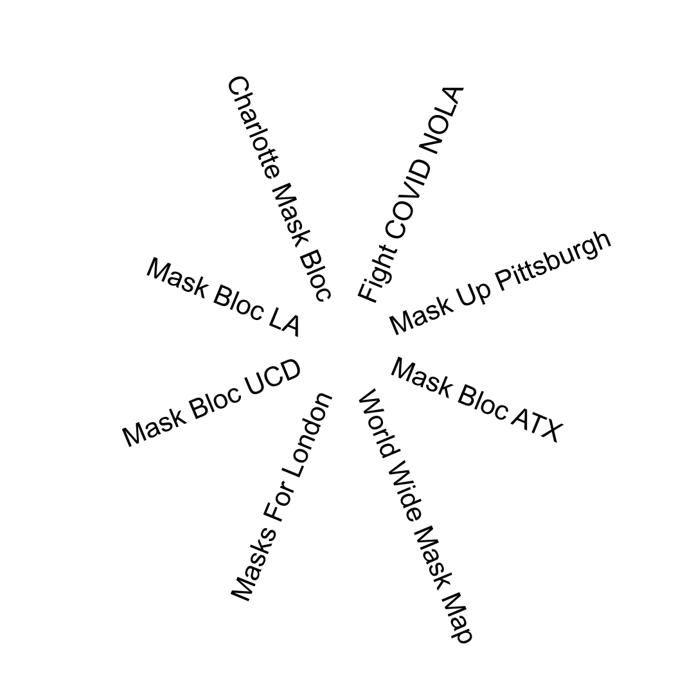

- [Sommaire/Table des Matières](#sommairetable-des-matières)
- 
- [Objectifs de ce guide](#objectifs-de-ce-guide)
- [Qu’est-ce qu’un Mask Bloc?](#quest-ce-quun-mask-bloc)
- [Qu’est-ce que l’entraide?](#quest-ce-que-lentraide)
  - [En quoi l’entraide se différencie des pratiques
    caritatives?](#en-quoi-lentraide-se-différencie-des-pratiques-caritatives)
  - [Comment sont organisés les groupes d’entraide?
    ](#comment-sont-organisés-les-groupes-dentraide)
  - [Qui peut participer à
    l’entraide?](#qui-peut-participer-à-lentraide)
  - [L’entraide c’est du soin
    communautaire](#lentraide-cest-du-soin-communautaire)
    - [Le soin communautaire sauve des
      vies](#le-soin-communautaire-sauve-des-vies)
    - [Le soin communautaire: une résistance à
      l’oppression](#le-soin-communautaire-une-résistance-à-loppression)
- [Par où commencer?](#par-où-commencer)
  - [Vous connecter à vos
    communautés](#vous-connecter-à-vos-communautés)
    - [Donner un nom à votre Mask
      Bloc](#donner-un-nom-à-votre-mask-bloc)
    - [Créer des liens en ligne](#créer-des-liens-en-ligne)
    - [D’autres moyens de créer des
      connexions:](#dautres-moyens-de-créer-des-connexions)
  - [S’informer sur les masques:](#sinformer-sur-les-masques)
    - [Que sont les masques à haute
      filtration?](#que-sont-les-masques-à-haute-filtration)
    - [Exemples de masques à haute
      filtration:](#exemples-de-masques-à-haute-filtration)
    - [  
      ](#section-3)
    - [Que signifient les lettres et les
      chiffres?](#que-signifient-les-lettres-et-les-chiffres)
    - [  
      ](#section-4)
- [Sélectionner des masques](#sélectionner-des-masques)
  - [Conseils par rapport à la variété des
    masques](#conseils-par-rapport-à-la-variété-des-masques)
    - [Les premiers éléments à prendre en considération pour se
      masquer](#les-premiers-éléments-à-prendre-en-considération-pour-se-masquer)
    - [Autres éléments à prendre en considération pour se masquer
      ](#autres-éléments-à-prendre-en-considération-pour-se-masquer)
- [Obtenir des masques ](#obtenir-des-masques)
  - [Acheter les masques vous-mêmes](#acheter-les-masques-vous-mêmes)
    - [Sites de vente en ligne](#sites-de-vente-en-ligne)
    - [Fabricants et distributeurs](#fabricants-et-distributeurs)
  - [Obtenir des dons](#obtenir-des-dons)
    - [Dons de gros distributeurs](#dons-de-gros-distributeurs)
    - [Dons de la part de membres de la communauté
      locale](#dons-de-la-part-de-membres-de-la-communauté-locale)
    - [Surplus d’entreprises et
      d’institutions](#surplus-dentreprises-et-dinstitutions)
    - [Enchères en ligne](#enchères-en-ligne)
    - [Autres blocs de masques, distros ou associations de défense face
      au
      COVID-19](#autres-blocs-de-masques-distros-ou-associations-de-défense-face-au-covid-19)
- [Distribuer les masques](#distribuer-les-masques)
  - [Recevoir les demandes et y
    répondre](#recevoir-les-demandes-et-y-répondre)
    - [Questions de sécurité liées aux
      demandes](#questions-de-sécurité-liées-aux-demandes)
  - [Répondre aux demandes](#répondre-aux-demandes)
  - [Méthodes de distribution en
    personne](#méthodes-de-distribution-en-personne)
    - [Organiser un stand](#organiser-un-stand)
    - [Lors d’évènements organisés par
      d’autres](#lors-dévènements-organisés-par-dautres)
    - [Distributions spontanées ](#distributions-spontanées)
    - [Les sacs à masques ](#les-sacs-à-masques)
  - [Distribution de masques en self-service
    ](#distribution-de-masques-en-self-service)
    - [Distributeurs de masques - Extérieur
      ](#distributeurs-de-masques---extérieur)
    - [Distributeurs de masques et présentoirs - Intérieur
      ](#distributeurs-de-masques-et-présentoirs---intérieur)
    - [Présentoir de masques DIY (Exemple
      1)](#présentoir-de-masques-diy-exemple-1)
    - [Autres organisations et
      institutions](#autres-organisations-et-institutions)
  - [Pas seulement des masques](#pas-seulement-des-masques)
  - [Discuter de l'utilité des masques et surmonter les
    hésitations](#discuter-de-lutilité-des-masques-et-surmonter-les-hésitations)
- 
- [Considérations supplémentaires](#considérations-supplémentaires)
  - [Fournitures supplémentaires](#fournitures-supplémentaires)
  - [Recruter des membres](#recruter-des-membres)
- [Derniers conseils et éléments à garder à l'esprit
  ](#derniers-conseils-et-éléments-à-garder-à-lesprit)
  - [Accueillir/adopter le repos et la temporalité
    “crip”](#accueilliradopter-le-repos-et-la-temporalité-crip)
- [Ressources supplémentaires et suggestions de
  lecture](#ressources-supplémentaires-et-suggestions-de-lecture)

*-l’ensemble du document est à relire, il y a sûrement des erreurs/typo*

*-j’ai surligné les passages à revoir/ vérifier/traduire*

*-je n’ai pas fait les conversions US \> France pour les liens, les
références aux types de masques etc, donc tout est à compléter/adapter
de ce côté-là*

*-les images sont aussi à remplacer*

*-la mise en page est à refaire pour que les liens dans le document
soient actifs et redirigent vers chaque partie comme dans l’original*

*Merci ! Go team !*

Comment lancer/commencer/démarrer/organiser un “Mask Bloc”

Un zine collaboratif réalisé par:

###### 

###### Description de l’image: Le nom des 8 collectifs disposés en étoile. En commençant d’en haut à droite et en lisant dans le sens des aiguilles d’une montre jusqu’à l’autre côté: Fight COVID NOLA, Mask Up Pittsburgh, Mask Bloc ATX, World Wide Mask Map, Masks for London, Mask Block UCD, Mask Bloc LA, and Charlotte Mask Bloc.

####  

# Sommaire/Table des Matières

[<u>Table of Contents</u>](#sommairetable-des-matières)

[<u>Purpose of this Guide</u>](#_amtgi8z3x4u)

[<u>What is a Mask Bloc?</u>](#quest-ce-quun-mask-bloc)

[<u>What is Mutual Aid?</u>](#quest-ce-que-lentraide)

> [<u>How Does Mutual Aid Differ from
> Charity?</u>](#en-quoi-lentraide-se-différencie-des-pratiques-caritatives)
>
> [<u>How are Mutual Aid Groups
> Organized?</u>](#comment-sont-organisés-les-groupes-dentraide)
>
> [<u>Who Can Do Mutual Aid?</u>](#qui-peut-participer-à-lentraide)
>
> [<u>Mutual Aid is Community
> Care</u>](#lentraide-cest-du-soin-communautaire)
>
> [<u>Community Care Saves
> Lives</u>](#le-soin-communautaire-sauve-des-vies)
>
> [<u>Community Care Pushes Back Against
> Harm</u>](#le-soin-communautaire-une-résistance-à-loppression)

[<u>Where to Start</u>](#par-où-commencer)

> [<u>Connecting to Your
> Community</u>](#vous-connecter-à-vos-communautés)
>
> [<u>Naming Your Mask Bloc</u>](#donner-un-nom-à-votre-mask-bloc)
>
> [<u>Connecting Online</u>](#créer-des-liens-en-ligne)
>
> [<u>Opening Social Media
> Accounts</u>](#créer-des-comptes-sur-les-réseaux-sociaux)
>
> [<u>Opening an Email Account</u>](#créer-une-adresse-mail)
>
> [<u>Other Kinds of
> Connections</u>](#dautres-moyens-de-créer-des-connexions)
>
> [<u>Becoming Informed about Masks</u>](#sinformer-sur-les-masques)
>
> [<u>What Are Hi-Fi
> Masks?</u>](#que-sont-les-masques-à-haute-filtration)
>
> [<u>Examples of Hi-Fi
> Masks:</u>](#exemples-de-masques-à-haute-filtration)
>
> [<u>What</u> <u>Do the Letters</u> <u>and Numbers
> Signify?</u>](#que-signifient-les-lettres-et-les-chiffres)

[<u>Selecting Masks</u>](#sélectionner-des-masques)

> [<u>Tips on Mask
> Variety</u>](#conseils-par-rapport-à-la-variété-des-masques)
>
> [<u>Basic Considerations in Masking</u>](#_kvm4tca3o689)
>
> [<u>Special Considerations in
> Masking</u>](#autres-éléments-à-prendre-en-considération-pour-se-masquer)
>
> [<u>Colors</u>](#la-couleur-des-masques)
>
> [<u>Strap Types and
> Materials</u>](#les-types-dattaches-et-leur-matière)
>
> [<u>Ear Loops vs. Head
> Straps</u>](#les-attaches-derrière-les-oreilles-ou-derrière-la-tête)
>
> [<u>Metals</u>](#métaux-utilisés)
>
> [<u>Latex</u>](#le-latex)
>
> [<u>Disability</u>](#les-handicaps)

[<u>Getting Masks</u>](#obtenir-des-masques)

> [<u>There are a few ways to get ahold of masks for
> distribution:</u>](#il-existe-plusieurs-façons-dobtenir-des-masques-à-distribuer)
>
> [<u>Purchasing Masks Yourself</u>](#acheter-les-masques-vous-mêmes)
>
> [<u>Online Retail Sites</u>](#sites-de-vente-en-ligne)
>
> [<u>Manufacturers and Distributors</u>](#fabricants-et-distributeurs)
>
> [<u>Popular Manufacturers and
> Distributors:</u>](#fabricants-et-distributeurs-connusréputés)
>
> [<u>Getting Donations</u>](#obtenir-des-dons)
>
> [<u>Donations from Large
> Distributors</u>](#dons-de-gros-distributeurs)
>
> [<u>Donations from Local Community
> Members</u>](#dons-de-la-part-de-membres-de-la-communauté-locale)
>
> [<u>Direct Donations of Masks and Other
> Supplies</u>](#dons-directs-de-masques-et-dautres-équipements)
>
> [<u>Fundraising with Your
> Community</u>](#lever-de-fonds-dans-votre-communauté)
>
> [<u>Ways to Accept
> Funds</u>](#différentes-manières-daccepter-des-dons)
>
> [<u>Deciding How to Accept
> Funds</u>](#décider-de-comment-accepter-des-dons)
>
> [<u>Maintaining Financial
> Accountability</u>](#maintenir-un-suivi-financier)
>
> [<u>Using Wishlists</u>](#utiliser-des-listes-de-souhaits)
>
> [<u>Surplus from Local Businesses and
> Institutions</u>](#surplus-dentreprises-et-dinstitutions)
>
> [<u>Workplaces</u>](#lieux-de-travail)
>
> [<u>Pharmacies</u>](#pharmacies)
>
> [<u>Institutions</u>](#institutions)
>
> [<u>Online Auctions</u>](#enchères-en-ligne)
>
> [<u>Popular Auction Sites to
> Check:</u>](#sites-connus-de-ventes-aux-enchères-à-consulter)
>
> [<u>Other Mask Blocs, Distros, or COVID-19 Advocacy
> Groups</u>](#_nuyk70vleqh6)

[<u>Giving Out Masks</u>](#distribuer-les-masques)

> [<u>Taking and Fulfilling Direct
> Requests</u>](#recevoir-les-demandes-et-y-répondre)
>
> [<u>Taking Mask Requests</u>](#recevoir-les-demandes-de-masques)
>
> [<u>Social Media
> DMs</u>](#en-mp-message-privé-sur-les-réseaux-sociaux)
>
> [<u>Phone</u>](#téléphone)
>
> [<u>Email</u>](#email)
>
> [<u>Online Forms</u>](#formulaires-en-ligne)
>
> [<u>Security Concerns with
> Requests</u>](#questions-de-sécurité-liées-aux-demandes)
>
> [<u>Security Needs are Diverse, Personal, and
> Individualized</u>](#les-besoins-en-sécurité-sont-divers-personnels-et-particuliers)
>
> [<u>Fulfilling Requests</u>](#répondre-aux-demandes)
>
> [<u>Pickup</u>](#récupération)
>
> [<u>Delivery</u>](#livraison)
>
> [<u>Shipping</u>](#envoi)
>
> [<u>Deciding How to Ship
> Masks</u>](#décider-de-comment-expédier-les-masques)
>
> [<u>Using Third-Party Shipment
> Services</u>](#utiliser-un-service-dexpédition-tiers)
>
> [<u>In-Person Distribution
> Methods</u>](#méthodes-de-distribution-en-personne)
>
> [<u>Tabling on Your Own</u>](#organiser-un-stand)
>
> [<u>Tabling
> Safely</u>](#mesures-de-sécurité-pour-la-gestion-dun-stand)
>
> [<u>Making Your Table Appealing</u>](#rendre-votre-stand-attractif)
>
> [<u>At Events Hosted by
> Others</u>](#lors-dévènements-organisés-par-dautres)
>
> [<u>Staying Covid-Safer at
> Events</u>](#réduire-les-risques-covid-lors-des-évènements)
>
> [<u>Random Handouts</u>](#distributions-spontanées)
>
> [<u>Mask Bags</u>](#les-sacs-à-masques)
>
> [<u>DIY Mask Bag</u>](#sac-à-masques-diy)
>
> [<u>Mask Bags for Purchase
> (Examples)</u>](#sacs-à-masques-disponibles-à-lachat-exemples)
>
> [<u>Self-Serve Mask
> Distribution</u>](#distribution-de-masques-en-self-service)
>
> [<u>Mask Dispensers —
> Outdoor</u>](#distributeurs-de-masques---extérieur)
>
> [<u>Outdoor Mask Dispenser
> (Example)</u>](#distributeur-de-masques-en-extérieur-exemple)
>
> [<u>Mask Dispenser
> Tips</u>](#conseils-pour-les-distributeurs-de-masques)
>
> [<u>Mask Dispensers and</u> <u>Diplays</u> <u>—
> Indoor</u>](#distributeurs-de-masques-et-présentoirs---intérieur)
>
> [<u>DIY Mask Display (Example 1)</u>](#_9ec46gs4dvn4)
>
> [<u>DIY Mask Display (Example
> 2)</u>](#distributeur-de-masques-diy-exemple-2)
>
> [<u>DIY Mask Dispenser (Example
> 3)</u>](#exemple-de-distributeur-de-masques-diy-exemple-3)
>
> [<u>Other Organizations and
> Institutions</u>](#autres-organisations-et-institutions)
>
> [<u>More Than Just Masks</u>](#pas-seulement-des-masques)
>
> [<u>Tips about Other
> Supplies</u>](#conseils-pour-les-fournitures-supplémentaires)
>
> [<u>Discussing Mask Utility and Overcoming
> Hesitancy</u>](#discuter-de-lutilité-des-masques-et-surmonter-les-hésitations)

[<u>Other Considerations</u>](#considérations-supplémentaires)

> [<u>Extra Supplies</u>](#fournitures-supplémentaires)
>
> [<u>Packing and Protecting</u>](#emballer-et-protéger)
>
> [<u>Labeling and Organizing</u>](#étiquetage-et-tri)
>
> [<u>Recruiting</u>](#recruter-des-membres)

[<u>Some Final Tips and Things to Keep in
Mind</u>](#derniers-conseils-et-éléments-à-garder-à-lesprit)

> [<u>Embracing Rest and Crip
> Time</u>](#accueilliradopter-le-repos-et-la-temporalité-crip)

[<u>Additional Resources and Reading
Recommendations</u>](#ressources-supplémentaires-et-suggestions-de-lecture)

#  

# Objectifs de ce guide

Ce guide a été créé pour aider les personnes intéressées par la création
d'un "Mask Bloc." La création d'une organisation d'entraide peut sembler
une tâche intimidante. Il y a beaucoup de choses à considérer : où
commencer, comment aborder la construction d'un bloc d'une manière qui
centre les plus marginalisés, et comment aider réellement celleux que
vous voulez aider.

Les blocs de masques qui ont créé ce zine ont abordé toutes ces
questions et se sont réunis pour mettre en commun leurs ressources,
partager leurs connaissances et travailler ensemble de manière
Internationale en tenant compte de la pluralité des expériences. Nous
avons inclus des conseils que nous avons recueillis au fur et à mesure
auprès de personnes effectuant un travail similaire. Certain·es d'entre
nous ont travaillé dans d'autres espaces d'entraide et ont partagé leurs
connaissances avec nous.

Bien que ce zine ait été principalement conçu et écrit par des “Mask
Blocs” existant aux États-Unis, nous espérons qu'il sera également utile
à d'autres. Dans la mesure du possible, nous avons fait de notre mieux
pour inclure des informations qui pourraient être pertinentes pour
d'autres pays ou pour signaler que quelque chose pourrait ne s'appliquer
qu'aux États-Unis.

Au fil de votre lecture, vous constaterez qu'il n'existe pas de solution
unique pour ce travail. Nous avons tous commencé un peu différemment, en
fonction de notre niveau d'énergie, de notre accès à l'information et de
nos moyens financiers. Quel que soit votre point de départ, nous
espérons que vous trouverez de la joie et de la solidarité dans ce
travail. Vous êtes invité·es à contacter les blocs qui vous entourent, y
compris ceux qui ont travaillé à la création de ce zine, si vous
recherchez de la camaraderie et des réponses à des questions que vous ne
trouvez pas dans ce zine.

\[[<u>back to top</u>](#sommairetable-des-matières)\]

# Qu’est-ce qu’un Mask Bloc?

Les blocs de masques fournissent gratuitement à leurs communautés des
masques de haute qualité et à haute filtration (Hi-Fi). Ils peuvent
également fournir d'autres outils et informations sur le COVID-19, la
purification de l'air et l'accessibilité.

Pour de nombreuses communautés marginalisées, notamment les personnes
handicapées, les homosexuel·les, les personnes racisées, les blocs de
masques sont devenus essentiels pour survivre à la pandémie de COVID-19
(SRAS-CoV-2). Les personnes multi-marginalisées font face à des
obstacles systémiques qui affectent leur accès aux mesures de prévention
du COVID-19, ainsi qu'aux réseaux associatifs et militants, à
l'expérience et aux diplômes.

Les blocs existaient avant les blocs de masques. Les blocs et autres
organisations d'entraide ont l'habitude de se mobiliser en réponse aux
incendies de forêt et aux catastrophes environnementales. Ces
organisations sont composées de personnes marginalisées qui sont
touchées par l'action - ou l'absence d'action - du gouvernement. Les
masques ont aussi une fonction transversale en tant que mesure de lutte
contre la surveillance, à l'heure où les gouvernements renforcent le
maintien de l'ordre et la surveillance.

\[[<u>back to top</u>](#sommairetable-des-matières)\]

# Qu’est-ce que l’entraide?

L'entraide est une pratique anarchiste, mais tout le monde peut la
pratiquer. Il y a de fortes chances que si vous envisagez de créer une
organisation d'entraide, vous soyez déjà conscient de la façon dont les
détenteurs du pouvoir continuent à nous nuire. Nous voulons que les gens
prennent conscience du pouvoir qu'iels ont lorsqu'iels se regroupent, en
particulier lorsque les institutions (gouvernements, systèmes
hospitaliers, chaînes d'approvisionnement capitalistes, etc.) nous
abandonnent.

\[[<u>back to top</u>](#sommairetable-des-matières)\]

## En quoi l’entraide se différencie des pratiques caritatives?

L'entraide est un terme générique qui décrit une diversité d'actions
entreprises par des individus et des organisations qui cherchent à aider
leurs communautés sans dépendre des gouvernements, des entreprises ou
des politiques souvent néfastes et des limites structurelles du monde
des organisations à but non lucratif, également appelé le "complexe
industriel à but non lucratif".

L'entraide diffère des associations caritatives ou d'une organisation à
but non lucratif par les points suivants :

-Les ressources sont distribuées gratutitement

-L'organisation se fait de manière horizontale ou non hiérarchique

-Les frontières entre le donneur et le receveur ne sont pas strictes

Contrairement aux organisations caritatives ou à but non lucratif, les
groupes d'entraide ne vérifient pas les ressources et n'imposent pas de
restrictions aux personnes qui peuvent bénéficier de leur aide. Nous ne
surveillons pas celleux qui reçoivent de l'aide, et il n'y a pas
d'autres obstacles pour la "mériter". Toute personne ayant besoin d'aide
la recevra, si le groupe d'entraide est en mesure de l'aider. Il est
essentiel pour les blocs de masques de fournir des masques
indépendamment de celleux qui, selon certains, le "méritent". Lorsque
nous commençons à prendre des décisions selon cette optique, nous
contribuons à l'eugénisme.

\[[<u>back to top of chapter</u>](#quest-ce-que-lentraide)\] \[[<u>back
to top</u>](#sommairetable-des-matières)\]

## Comment sont organisés les groupes d’entraide? 

La plupart des groupes d'entraide, y compris les blocs de masques, ne
souscrivent pas à une organisation hiérarchique ou "descendante".
Beaucoup préfèrent les structures horizontales, la prise de décision par
consensus ou une organisation non hiérarchique. Il n'y a pas de PDG, pas
de conseil d'administration, ni d'autres mécènes envers lesquels nous
sommes redevables. Nous répondons aux besoins de celleux qui en ont
besoin.

\[[<u>back to top of chapter</u>](#quest-ce-que-lentraide)\] \[[<u>back
to top</u>](#sommairetable-des-matières)\]

## Qui peut participer à l’entraide?

Tout le monde peut donner et recevoir de l'aide mutuelle. Aucune
qualification n'est requise. Cependant, les personnes les plus touchées
et marginalisées en cette ère d'eugénisme sont les mieux qualifiées - et
souvent les plus motivées - pour lancer des projets tels que les blocs
de masques. Nous espérons que ce guide améliorera l'accessibilité,
encouragera à suivre les conseils des plus marginalisé·es et apportera
davantage de ces outils de survie vitaux (masques) aux communautés dans
le besoin.

Étant donné que les personnes les plus marginalisées sont souvent à
l'origine de ces organisations, elles sont également souvent dans le
besoin. Votre organisation n'est pas composée de "sauveur·euses" venant
de l'extérieur de la communauté, mais de celleux qui comptent également
sur le soutien de cette communauté. Votre organisation d'entraide peut
vous aider et aider les autres. Ces deux aspects coexistent et ne
s'excluent pas.

\[[<u>back to top of chapter</u>](#quest-ce-que-lentraide)\] \[[<u>back
to top</u>](#sommairetable-des-matières)\]

## L’entraide c’est du soin communautaire

Les pratiques de soin communautaire remettent en question la
concentration du pouvoir en démontrant que nous pouvons prendre soin les
un·es des autres face à la réponse tiède et dangereuse de l'État au
COVID-19. Au lieu de considérer les membres de notre communauté comme
des personnes étrangères que nous méprisons ou ignorons complètement -
contribuant ainsi à l'eugénisme dont nous faisons l'objet - nous nous
rapprochons au contraire les un·es des autres. En pratiquant le soin
communautaire, nous devenons moins aliéné·es les un·es des autres et
moins aliéné·es de nous-mêmes (nous nous rapprochons des autres et de
nous-mêmes).

\[[<u>back to top of chapter</u>](#quest-ce-que-lentraide)\] \[[<u>back
to top</u>](#sommairetable-des-matières)\]

### Le soin communautaire sauve des vies

Les pratiques de soin communautaire sont le fruit de collaborations.
Elles tissent des liens de soutien et d'interdépendance entre voisin·es
et peuvent transformer des inconnu·es en ami-es, voire en familles. Pour
beaucoup, le soin communautaire est synonyme de survie. L'épidémie de
COVID-19 a modifié les types de soins dont les gens ont besoin. Alors
que les gouvernements sont à la traîne et ignorent les besoins de leur
population, les communautés se sont mobilisées.

\[[<u>back to top of chapter</u>](#quest-ce-que-lentraide)\] \[[<u>back
to top</u>](#sommairetable-des-matières)\]

### Le soin communautaire: une résistance à l’oppression

Les gouvernements conservent leur pouvoir en promettant qu'ils vont
gérer la situation ou qu'ils la gèrent déjà. Ils publient des
déclarations officielles minimisant l'état de la pandémie et proposent
des moyens inadéquats pour y faire face \[lien\]. En 2023, de nombreux
gouvernements se concentrent uniquement sur ce qu'il faut faire après
avoir été infecté, au lieu de se concentrer sur la prévention des
infections. Les gouvernements, les groupes de lobbying des entreprises
et les médias affirment également de manière répétée que la pandémie est
terminée et que les gens ne se préoccupent pas du COVID-19. Les
communautés peuvent montrer au gouvernement et aux autres personnes au
pouvoir qu'elles ont tort et que nous refusons de permettre l'infection
et la destruction de nos communautés.

\[[<u>back to top of chapter</u>](#quest-ce-que-lentraide)\] \[[<u>back
to top</u>](#sommairetable-des-matières)\]

# Par où commencer?

Il suffit d'une seule personne pour créer un bloc de masques. La manière
dont vous commencez dépend de vous.

En général, il y a deux points de départ pour la plupart des blocs de
masques :

Créer des liens \[aller à la section\] :

Ça peut inclure de choisir un nom \[aller à la section\], d'utiliser les
réseaux sociaux \[aller à la section\] ou l'envoi d'emails \[aller à la
section\], ou de créer des liens d'autres manières \[aller à la
section\].

Acquérir des masques \[aller à la section\] :

Ça peut inclure de se familiariser avec les masques Hi-Fi \[aller à la
section\] et les différents types \[aller à la section\] de masques,
ainsi qu'avec la signification de leurs désignations \[aller à la
section\].

Cela vous aidera à sélectionner \[aller au chapitre\] les bons types de
masques à offrir à votre communauté parmi les nombreuses variétés
disponibles \[aller à la section\]. Il est également utile de connaître
les facteurs qui peuvent influencer les besoins et les préférences d'une
personne en matière de masques \[aller à la section\].

Il n'y a pas de mauvais point de départ ! Choisissez ce qui vous semble
le plus faisable !

\[[<u>back to top</u>](#sommairetable-des-matières)\]

## Vous connecter à vos communautés

Une grande partie de la distribution des masques (parfois appelée
"distro") est la sensibilisation. Les membres de votre communauté
doivent savoir que votre bloc de masques existe, comment le contacter et
être en mesure de faire des demandes facilement. Deux des moyens les
plus courants pour y parvenir sont en ligne : les réseaux sociaux et les
mails.

### Donner un nom à votre Mask Bloc

Lorsque vous créez une page sur les réseaux sociaux ou dévloppez une
autre forme de visibilité, la première chose dont vous avez besoin,
c'est d'un nom. De nombreux mask blocs choisissent de s'appeler
simplement "Mask Bloc \_\_\_\_" et inscrivent le nom de leur ville,
leurs initiales ou leur code postal à la place de l'espace vide. Mais
c'est à votre groupe de décider comment vous voulez vous nommer.

\[[<u>back to top of chapter</u>](#par-où-commencer)\] \[[<u>back to
top</u>](#sommairetable-des-matières)\]

### Créer des liens en ligne

#### Créer des comptes sur les réseaux sociaux

C'est à vous de choisir la ou les plateformes de réseaux sociaux que
vous souhaitez utiliser, en fonction de votre aisance et de votre
familiarité avec ceux qui existent. Vous pouvez également vous
concentrer sur les plateformes les plus couramment utilisées par les
personnes que vous espérez aider, car c'est peut-être le meilleur moyen
d'atteindre votre communauté et donc de répondre à ses besoins.

\[[<u>back to top of chapter</u>](#par-où-commencer)\] \[[<u>back to
top</u>](#sommairetable-des-matières)\]

#### Créer une adresse mail:

Pour envoyer un mail, certains blocs de masques utilisent Proton, tandis
que d'autres utilisent Gmail. Certains utilisent les deux, souvent pour
des raisons ou des objectifs différents. Votre choix dépend en grande
partie du degré de confidentialité et de sécurité que vous souhaitez
pour votre correspondance par mail. Une adresse e-mail spécifique à un
bloc de masques vous permet également, à vous et aux autres membres, de
prendre un peu de distance ; tout ne se fera pas sous le nom d'une seule
personne. Nous reviendrons plus en détail sur la sécurité en ligne dans
d'autres parties de ce guide \[[<u>jump to
section</u>](#questions-de-sécurité-liées-aux-demandes)\].

\[[<u>back to top of chapter</u>](#par-où-commencer)\] \[[<u>back to
top</u>](#sommairetable-des-matières)\]

### D’autres moyens de créer des connexions:

Il existe de nombreuses façons de faire connaître l'existence de votre
bloc de masques, mais internet est un bon point de départ. C'est un
moyen familier et pratique pour de nombreuses personnes, c'est souvent
le plus efficace. Dans les sections suivantes, nous aborderons les
moyens d'établir des connexions supplémentaires en effectuant une
distribution en personne \[aller à la section\], en s'engageant auprès
des institutions \[aller à la section\] et même en recrutant d'autres
personnes pour participer à vos efforts de distribution \[aller à la
section\].

\[[<u>back to top of chapter</u>](#par-où-commencer)\] \[[<u>back to
top</u>](#sommairetable-des-matières)\]

## S’informer sur les masques:

L'objectif principal d'un bloc de masques est de distribuer des masques
de haute qualité et à haute filtration (également connus sous le nom de
masques Hi-Fi). Ces masques ont différentes désignations en fonction de
l'endroit où vous vous trouvez dans le monde.

### Que sont les masques à haute filtration?

Les masques Hi-Fi sont considérés comme des masques capables de filtrer
un pourcentage très important de particules en suspension extrêmement
petites contenant des polluants dangereux, tels que la fumée, ainsi que
des particules contenant des bactéries et des virus pathogènes, y
compris le COVID-19. Dans de nombreux pays, des normes sont établies et
des organismes réglementés certifient que ces masques présentent le bon
niveau de filtration et d'ajustement pour garantir qu'ils fourniront le
haut degré de protection attendu à l'utilisateur.

\[[<u>back to top of chapter</u>](#par-où-commencer)\] \[[<u>back to
top</u>](#sommairetable-des-matières)\]

### Exemples de masques à haute filtration:

- KF94

- FFP2

- FFP3

- KN95

- N95

- P100

###  

### Que signifient les lettres et les chiffres?

Les masques N95 et P100 sont également connus sous le nom de
respirateurs, en particulier dans les milieux professionnels. Les
désignations N et P signifient qu'ils sont certifiés par le NIOSH, qui
définit les normes de sécurité au travail pour les masques Hi-Fi aux
États-Unis. Les masques FFP2 et FFP3 ont subi des tests à peu près
équivalents à ceux des masques N95 et P100, respectivement, mais basés
sur la norme européenne.

Contrairement aux normes professionnelles, les masques KF94 sont
conformes à une norme coréenne de protection respiratoire et
d'ajustement conçue pour être accessible à la plupart des gens pour un
usage quotidien, et les masques KN95 répondent à une norme chinoise
similaire.

Cette liste n'est pas exhaustive et vous pouvez toujours proposer
d'autres options (par exemple, il existe également des masques classés
N99 et N100), mais l'une ou l'autre de ces options constitue un
excellent premier pas. Pour plus de facilité, dans la suite de ce zine,
nous ferons référence à tous les masques pouvant filtrer le COVID-19 en
tant que "masques hi-fi" ou simplement "masques" lorsque nous parlerons
en général et nous préciserons les types de masques auxquels nous
faisons référence par leur nom uniquement lorsque cela sera nécessaire.

REMARQUE IMPORTANTE : les masques en tissu et les masques chirurgicaux
n'offrent PAS de protection substantielle contre COVID-19 ou d'autres
agents pathogènes en suspension dans l'air.

Vous pouvez consulter ici une base de données \[lien\] qui détaille les
différents types de masques disponibles. Le sous-reddit Masks4All
\[lien\] est également une excellente ressource.

\[[<u>back to top of chapter</u>](#par-où-commencer)\] \[[<u>back to
top</u>](#sommairetable-des-matières)\]

###  

# Sélectionner des masques

La forme et la taille des visages varient d'une personne à l'autre,
c'est pourquoi il est utile de disposer d'une grande variété de masques.
Un masque qui convient très bien à une personne peut ne pas être étanche
sur le visage d'une autre personne. Le fait de proposer des masques de
tailles, de styles et de couleurs différents peut encourager un plus
grand nombre de personnes à les porter. Les masques pour enfants, ainsi
que les masques qui s'adaptent bien aux visages des adultes les plus
petits, sont particulièrement difficiles à trouver, et votre bloc peut
donc envisager d'en faire une priorité.

Vous trouverez ci-dessous une image qui résume quelques-unes des façons
dont les masques peuvent répondre à la plupart des critères, mais pas à
tous, pour chaque personne. Il ne s'agit pas d'une mesure objective,
mais elle met en évidence certains points communs.

<table>
<colgroup>
<col style="width: 50%" />
<col style="width: 49%" />
</colgroup>
<tbody>
<tr>
<td></td>
<td><h6
id="description-de-limage-un-diagramme-de-venn-sans-titre-qui-se-concentre-sur-trois-des-caractéristiques-les-plus-populaires-de-plusieurs-types-de-masques.-les-trois-cercles-qui-composent-le-diagramme-sont-étiquetés-comme-suit-abordable-adapté-à-la-plupart-des-visages-et-dapparence-vaguement-inoffensive.-diverses-parties-des-cercles-et-leurs-intersections-portent-les-noms-des-masques-qui-répondent-à-ces-critères.-à-lintersection-de-abordable-et-de-convient-à-la-plupart-des-visages-se-trouve-bec-de-canard.-à-lintersection-de-convient-à-la-plupart-des-visages-et-de-vaguement-inoffensif-se-trouve-trois-plis.-dans-la-partie-de-vaguement-inoffensif-qui-na-pas-dintersection-il-y-a-deux-plis.-à-lintersection-de-vaguement-inoffensif-et-abordable-se-trouve-un-dôme.-aucun-type-de-masque-nest-répertorié-dans-les-catégories-abordable-ou-convient-à-la-plupart-des-visages-et-rien-nest-répertorié-à-lintersection-de-ces-trois-catégories.">Description
de l'image : Un diagramme de Venn sans titre qui se concentre sur trois
des caractéristiques les plus populaires de plusieurs types de masques.
Les trois cercles qui composent le diagramme sont étiquetés comme suit :
abordable, adapté à la plupart des visages et d'apparence vaguement
inoffensive. Diverses parties des cercles et leurs intersections portent
les noms des masques qui répondent à ces critères. À l'intersection de
"abordable" et de "convient à la plupart des visages" se trouve "bec de
canard". À l'intersection de "convient à la plupart des visages" et de
"vaguement inoffensif" se trouve "trois-plis". Dans la partie de
"vaguement inoffensif" qui n'a pas d'intersection, il y a "deux-plis". À
l'intersection de "vaguement inoffensif" et "abordable" se trouve un
"dôme". Aucun type de masque n'est répertorié dans les catégories
"abordable" ou "convient à la plupart des visages", et rien n'est
répertorié à l'intersection de ces trois catégories.</h6></td>
</tr>
</tbody>
</table>

\[[<u>back to top of chapter</u>](#sélectionner-des-masques)\]
\[[<u>back to top</u>](#sommairetable-des-matières)\]

## Conseils par rapport à la variété des masques

Les corps, y compris les visages, et les expériences qui en découlent
sont très diversifiés ! Le fait de disposer d'une grande variété de
styles de masques peut vous aider à répondre aux besoins d'un plus grand
nombre de personnes.

### Les premiers éléments à prendre en considération pour se masquer

Certains facteurs doivent être pris en compte lors du choix d'un masque,
notamment les caractéristiques, les formes et les tailles des visages.
Ces facteurs peuvent être les suivants:

- la taille du visage (qui peut influer sur le confort relatif des
  différentes formes et dimensions de masque)

- le tour de tête (qui peut influencer le confort de certains types de
  sangles)

- la hauteur de l'arête nasale (plus haute et plus étroite ou plus plate
  et plus large)

- la forme du visage (rond ou anguleux, plus grand ou plus petit, forme
  du menton et de la mâchoire, etc.)

- le placement des yeux (proches ou larges, profondeur, forme, etc.)

### Autres éléments à prendre en considération pour se masquer 

D’autres facteurs à prendre en considération peuvent être:

- La couleur du masque \[[<u>jump to
  topic</u>](#la-couleur-des-masques)\]

- Différents types de sangles (y compris les mdoèles sans
  sangles)\[[<u>\[jump to
  section</u>](#les-types-dattaches-et-leur-matière)\]

- Sans métal \[ [<u>\[jump to section\]</u>](#métaux-utilisés)\]

- Sans latex \[ [<u>\[jump to section\]</u>](#le-latex)\]

- Certains handicaps \[ [<u>\[jump to section\]</u>](#les-handicaps)\]

\[[<u>back to top of
section</u>](#conseils-par-rapport-à-la-variété-des-masques)\]
\[[<u>back to top of chapter</u>](#par-où-commencer)\] \[[<u>back to
top</u>](#sommairetable-des-matières)\]

#### La couleur des masques

La couleur peut ne pas sembler importante à première vue, mais le fait
d'avoir des couleurs autres que le blanc peut rendre les masques plus
accessibles et plus agréables à porter. Elles peuvent même réduire le
risque de harcèlement, en particulier au travail.

Le noir est une couleur populaire et discrète. Pour les blocs basés aux
États-Unis, nous savons que BNX \[lien\] fabrique des N95 noirs et que
WellBefore \[lien\] propose des KN95 noirs avec des sangles pour la tête
qui, d'après certains tests d'utilisateurs indépendants, peuvent
s'adapter et filtrer l'air de manière comparable à de nombreux N95. Dans
l'UE, iMask fabrique des masques FFP2 \[lien\] et FFP3 \[lien\] en noir.

\[[<u>back to top of
section</u>](#conseils-par-rapport-à-la-variété-des-masques)\]
\[[<u>back to top of chapter</u>](#par-où-commencer)\] \[[<u>back to
top</u>](#sommairetable-des-matières)\]

#### Les types d’attaches et leur matière

Certaines personnes peuvent avoir besoin d'un type de sangle spécifique
pour porter un masque confortablement, voire pour le porter tout court.
Certaines personnes peuvent trouver les attaches derrière la tête
douloureuses et préférer les attaches derrières les oreilles ; d'autres
peuvent trouver les attaches derrière les oreilles douloureuses et
demander des attaches autour de la tête. Il est conseillé d'avoir les
deux types de sangles à portée de main, ainsi que des masques sans
sangle - Readimask est courant, Alliant Biotech est une option moins
chère - pour les personnes qui trouvent les deux types de sangles
douloureuses ou qui en ont besoin pour d'autres raisons. Le type
d'élastique utilisé pour la sangle peut également influer sur le confort
ou la portabilité.

\[[<u>back to top of
section</u>](#conseils-par-rapport-à-la-variété-des-masques)\]
\[[<u>back to top of chapter</u>](#par-où-commencer)\] \[[<u>back to
top</u>](#sommairetable-des-matières)\]

#### Les attaches derrière les oreilles ou derrière la tête

Les préférences en matière d'attaches varient d'une personne à l'autre,
mais il y a d'autres aspects pour lesquels il peut être utile de
connaître la différence. Par exemple, pour obtenir une classification
NIOSH, les masques Hi-Fi doivent être munis d'attaches derrière la tête.
Par conséquent, tous les masques N95, N99, N100 et P100 sont dotés de
sangles de tête, et tout masque doté d'attaches auriculaires ne peut pas
être un masque N95. Les études montrent également que, pour la plupart
des gens, les attaches derrière la tête assurent une étanchéité plus
fiable contre le visage.

Contrairement aux masques N95, la plupart des masques KN95 et presque
tous les masques KF94 ont des attaches auriculaires. Les masques FFP
peuvent être dotés de l'un ou l'autre de ces éléments, bien que les
attaches auriculaires ne se trouvent généralement que sur les masques
FFP2, dont l'indice de protection est inférieur à celui des masques
FFP3. Quelques fabricants proposent des masques fabriqués et certifiés
en Chine selon la norme KN95, mais avec des attaches derrière la tête en
option. C'est le cas du WellBefore 3D Pro, dont le lien figure
ci-dessus, qui dispose à la fois d'attaches derrière la tête et derrière
les oreilles.

CONSEIL : En raison de la réglementation NIOSH sur les attaches derrière
les oreilles, repérer un masque étiqueté "N95" qui possède des attaches
derrière les oreilles peut être un moyen d'identifier rapidement une
contrefaçon de mauvaise qualité dont le niveau de protection n'est pas
digne de confiance.

###### Description des images : Figure 1 (côté gauche) : Dessin au trait en noir et blanc d'une personne aux cheveux courts regardant la page de gauche. Elle porte un masque indéfinissable avec une épaisse bande rouge autour de l'oreille (boucle d'oreille). Figure 2 (côté droit) : Dessin au trait en noir et blanc d'une personne aux cheveux courts regardant vers la gauche. Elle porte un masque indéfinissable avec d'épaisses bandes rouges passant derrière la tête (serre-tête).

\[[<u>back to top of
section</u>](#conseils-par-rapport-à-la-variété-des-masques)\]
\[[<u>back to top of chapter</u>](#par-où-commencer)\] \[[<u>back to
top</u>](#sommairetable-des-matières)\]

#### Métaux utilisés

Certaines personnes ont besoin de masques sans métal à porter lors
d'examens médicaux tels que les IRM. D'autres peuvent être allergiques à
certains alliages métalliques. Les masques autocollants sans bretelles,
comme ceux de Readimask \[lien\] ou d'Alliant Biotech \[lien\], ne
contiennent pas de métal. Il existe également d'autres masques sans
métal.

\[[<u>back to top of
section</u>](#conseils-par-rapport-à-la-variété-des-masques)\]
\[[<u>back to top of chapter</u>](#par-où-commencer)\] \[[<u>back to
top</u>](#sommairetable-des-matières)\]

#### Le latex

Le latex est un allergène assez courant et de nombreux masques
contiennent du caoutchouc de latex dans leurs élastiques. Toutes les
personnes allergiques au latex ne le savent pas forcément. Cela signifie
que les responsabilités d'un bloc peuvent consister à informer les
personnes allergiques au latex de ce risque et à être prêt à leur
proposer des masques sans latex. Le BYD DE2322 \[lien\] est un exemple
de masque sans latex, et tous les masques 3M sont sans latex \[lien\].

\[[<u>back to top of
section</u>](#conseils-par-rapport-à-la-variété-des-masques)\]
\[[<u>back to top of chapter</u>](#par-où-commencer)\] \[[<u>back to
top</u>](#sommairetable-des-matières)\]

#### Les handicaps

En plus de tout ce qui précède, certains handicaps peuvent affecter la
facilité et le niveau de confort pour enfiler, retirer ou porter des
masques. Parmi les exemples, on peut citer certaines restrictions de
mobilité, des différences au niveau des membres ou du visage, et des
affections qui provoquent des douleurs au niveau du visage ou de la
tête. Il existe d'autres allergies et sensibilités qui peuvent entraîner
des réactions aux adhésifs, aux odeurs (également appelées "dégagements
gazeux") et à d'autres caractéristiques de masques spécifiques. Soyez
prêt·es à écouter et à apprendre, afin d'offrir des soins et de l'aide
aux personnes qui luttent pour trouver un masque adapté à leur handicap
et à leur état de santé.

\[[<u>back to top of
section</u>](#conseils-par-rapport-à-la-variété-des-masques)\]
\[[<u>back to top of chapter</u>](#par-où-commencer)\] \[[<u>back to
top</u>](#sommairetable-des-matières)\]

# Obtenir des masques 

La distribution de masques de haute qualité est essentielle pour un bloc
de masques. Maintenant que vous savez comment apprendre à sélectionner
les masques \[passer à la section\] ou la variété de masques qui
répondent le mieux aux besoins de votre communauté, vous devrez
apprendre où acquérir des masques à haute filtration et décider quelles
options répondent le mieux à vos besoins.

##### Il existe plusieurs façons d'obtenir des masques à distribuer :

- Sites de vente en ligne \[sauter à la section\]

- Fabricants et distributeurs \[aller à la section\]

- Liste de distributeurs connus \[sauter à la section\]

- Dons \[aller à la section\]

- De la part de grands distributeurs ( commerçants, grossistes et
  organisations à but non lucratif) \[sauter à la section\]

- De la part de membres de la communauté locale \[aller à la section\]

- In-Kind \[aller à la section\]

- Levée de fonds \[aller à la section\]

- Excédents locaux d'entreprises et d'institutions (lieux de travail,
  pharmacies, etc.) \[aller à la section\]

- Enchères en ligne \[aller à la section\]

- Autres blocs de masques, distros ou associations de défense face au
  COVID-19 \[sauter à la section\]

\[[<u>back to top</u>](#sommairetable-des-matières)\]

## Acheter les masques vous-mêmes

Lorsque vous achetez des masques, vous pouvez les acheter en bloc ou
individuellement.

### Sites de vente en ligne

Les sites de vente en ligne grand public tels qu'Amazon et Walmart
regorgent de vendeurs tiers peu fiables, ce qui n'est pas toujours
évident. De nombreux masques vendus sur ces plateformes sont des faux
qu'il est difficile de repérer au premier coup d'œil, même en personne,
et c'est pourquoi de nombreuses personnes choisissent de les éviter
complètement.

Si votre bloc décide de faire des achats sur Amazon ou des sites
similaires, vérifiez soigneusement chaque annonce pour déterminer si le
produit est fabriqué et vendu par un fabricant vérifié. Il est souvent
plus fiable de cliquer sur des liens provenant directement du site web
de la marque, comme BNX ou GVS, que d'effectuer une recherche
directement sur Amazon. Inspectez toujours le produit à l'arrivée pour
vous assurer qu'il arrive dans l'emballage du fabricant et qu'il porte
les inscriptions prévues, telles que la date d'expiration, que
l'emballage contient toutes les informations internes habituelles sur le
produit, et que les masques ont la construction et les inscriptions
prévues. (Voir Ressources complémentaires \[aller à la page\] pour des
liens vers des informations sur la reconnaissance des normes NIOSH et
l'identification des masques contrefaits.

\[[<u>back to top of chapter</u>](#obtenir-des-masques)\] \[[<u>back to
top</u>](#sommairetable-des-matières)\]

### Fabricants et distributeurs

Plutôt que d'utiliser les grands sites de commerce électronique, de
nombreuses personnes, qu'il s'agisse de particuliers ou de blocs de
masques, préfèrent s'approvisionner auprès de distributeurs fiables de
marques de masques réputées. La plupart d'entre eux sont des grossistes
spécialisés dans la fourniture d'équipements de protection à d'autres
entreprises et qui vendent également aux particuliers via des boutiques
en ligne.

En outre, les principaux fabricants de masques, tels que 3M et Blox,
vous permettent souvent d'acheter directement sur leur site ou vous
renvoient de leur site à un distributeur agréé, tel que Fisher
Scientific, Industrial Safety ou Stauffer Safety, où vous pouvez
effectuer votre achat.

\[[<u>back to top of section</u>](#acheter-les-masques-vous-mêmes)\]
\[[<u>back to top of chapter</u>](#obtenir-des-masques)\] \[[<u>back to
top</u>](#sommairetable-des-matières)\]

#### Fabricants et distributeurs connus/réputés:

- 3M
  \[[<u>link</u>](https://www.3m.com/3M/en_US/p/c/ppe/healthcare-masks/)\]

- Blox \[[<u>link</u>](https://bloxdirect.com/collections/all)\]

- Bona Fide
  \[[<u>link</u>](https://bonafidemasks.com/3-ply-masks-level-3/)\]
  (bulk discounts)

- Project N95
  \[[<u>link</u>](https://www.projectn95.org/collections/respirators/)\]
  (sells a variety of brands, all verified)

- Powecom \[[<u>link</u>](https://powecomsupply.com/)\]

- WellBefore \[[<u>link</u>](https://wellbefore.com/collections/masks)\]

- BNX
  \[[<u>link</u>](https://bnx.com/made-in-usa/n95-mask-respirators-kn95-face-masks/)\]

- Gerson Company
  \[[<u>link</u>](https://www.gersonco.com/product-category/respiratory/)\]

- Moldex
  \[[<u>link</u>](https://www.moldex.com/product-category/respiratory-protection/)\]

- Fisher Scientific
  \[[<u>link</u>](https://www.fishersci.com/us/en/catalog/search/products?keyword=n95)\]
  (known for having occasional amazing sales)

- Industrial Safety \[[<u>link</u>](https://industrialsafety.com/)\]

- Stauffer Glove & Safety
  \[[<u>link</u>](https://www.stauffersafety.com/)\]

- Be Healthy USA \[[<u>link</u>](https://behealthyusa.net/)\] (frequent
  sales on bulk KF94s, including kids' sizes)

**Note:** Due to regulations in California, Fisher Scientific cannot
ship to residential addresses in California.

\[[<u>back to top of section</u>](#acheter-les-masques-vous-mêmes)\]
\[[<u>back to top of chapter</u>](#obtenir-des-masques)\] \[[<u>back to
top</u>](#sommairetable-des-matières)\]

## Obtenir des dons

### Dons de gros distributeurs

Certains grands distributeurs, tels que Blox, Project N95 et Bona Fide,
fournissent gratuitement des masques aux blocs de masques et autres
groupes de distribution de masques. Les quantités peuvent varier, tout
comme la méthode d'acquisition des masques (demande ou courriel).

Bona Fide préfère travailler avec ceux qui ont une désignation 501(c)(3)
; cependant, dans le passé, ils ont fourni des masques à des groupes qui
n'avaient pas cette désignation. Il peut être utile de s'associer avec
quelqu'un ou de rechercher un parrainage fiscal auprès d'une
organisation que vous connaissez et qui possède cette désignation, afin
d'obtenir un don. La page sur les prix commerciaux à haut volume
\[lien\] fournit des adresses électroniques que vous pouvez utiliser
pour obtenir des dons.

Le projet N95 dispose d'un formulaire \[lien\] sur son site web que les
groupes peuvent remplir pour demander des masques. Dans ce formulaire,
vous pouvez indiquer comment vous prévoyez de les distribuer et quels
sont les groupes que vous espérez cibler par le biais de la
distribution. Ils vous contacteront ensuite pour répondre à vos
questions ou pour planifier la livraison. Vous pouvez demander des types
de masques spécifiques, mais ce que vous recevrez variera en fonction de
ce qui est actuellement disponible et du montant du don. Le plus petit
don commence à 2 400 masques. Ils sont également connus pour fournir des
demi-palettes et même des palettes entières, qui contiennent plus de 20
000 masques.

Powecom et WellBefore ont également offert des dons aux blocs de masques
à l'occasion. Le propriétaire de Blox a parfois contacté les blocs de
masques via Twitter pour faire don de N95, bien que cela semble
sporadique.

Une autre source de dons importants peut être les entreprises et les
fabricants locaux de matériel médical. Un groupe de Pittsburgh a reçu 19
000 N95 d'un fabricant cherchant à réduire ses stocks. Il peut être
intéressant de s'adresser à ces entreprises.

\[[<u>back to top of section</u>](#obtenir-des-dons)\] \[[<u>back to top
of chapter</u>](#obtenir-des-masques)\] \[[<u>back to
top</u>](#sommairetable-des-matières)\]

### Dons de la part de membres de la communauté locale

Certains blocs de masques reçoivent des dons - qu'il s'agisse de
contributions monétaires ou de dons "in-kind" (masques et autres
articles déjà achetés par d'autres) - de la part des membres de la
communauté locale. Les blocs de masques peuvent ainsi collecter des
fonds pour l'achat de masques, augmenter leur stock de masques et
acquérir d'autres fournitures nécessaires.

\[[<u>back to top of section</u>](#obtenir-des-dons)\] \[[<u>back to top
of chapter</u>](#obtenir-des-masques)\] \[[<u>back to
top</u>](#sommairetable-des-matières)\]

#### Dons directs de masques et d’autres équipements

De nombreuses personnes examinent plusieurs options de masques avant de
choisir celui qui leur convient. Cela signifie qu'un grand nombre de
personnes ont chez elles des masques inutilisés qu'elles souhaitent
donner afin d'aider les gens. En tant que bloc de masques, vous pouvez
inspecter ces masques et redistribuer des masques propres et en bon
état. Pour les masques qui ne sont pas scellés individuellement, vous
pouvez les reconditionner vous-même (individuellement ou par paquets)
dans des sacs en plastique ou en papier et utiliser ces masques pour la
distribution.

Il se peut également que les membres de votre communauté soient en
mesure de faire don de tests rapides en surplus, d'autres formes
d'équipement de protection individuelle (EPI), de filtres, de
ventilateurs ou de ruban adhésif pour les purificateurs d'air
artisanaux, ou d'autres articles que vous pourrez redistribuer aux
personnes qui en ont besoin. Ils peuvent également être en mesure de
vous fournir des fournitures supplémentaires qui peuvent contribuer aux
efforts de distribution de votre bloc.

Les dons directs de masques et autres contributions en nature peuvent
vous éviter d'avoir à vous préoccuper de la comptabilité et de la
responsabilité fiscale potentielle qui peuvent accompagner les dons
d'argent.

\[[<u>back to top of section</u>](#obtenir-des-dons)\] \[[<u>back to top
of chapter</u>](#obtenir-des-masques)\] \[[<u>back to
top</u>](#sommairetable-des-matières)\]

#### Lever de fonds dans votre communauté

Les dons monétaires de la communauté peuvent avoir un impact important
sur la quantité de masques et d'autres fournitures que vous pouvez
fournir. Ce webinaire \[lien\] est une excellente source d'informations
sur la gestion de l'argent et les taxes pour les groupes d'entraide.

Les personnes désireuses de contribuer à la sécurité des citoyens sont
plus nombreuses que vous ne le pensez. Les personnes prudentes disposant
d'un revenu disponible peuvent être intéressées. Toutefois, de nombreux
autres membres de la communauté peuvent également vouloir et pouvoir
apporter leur contribution. Les petits dons peuvent faire beaucoup.

Gardez à l'esprit que nous sommes là pour aider les membres de notre
communauté qui en ont le plus besoin ; nous ne sommes pas là pour
impressionner de riches donateurs.

\[[<u>back to top of section</u>](#obtenir-des-dons)\] \[[<u>back to top
of chapter</u>](#obtenir-des-masques)\] \[[<u>back to
top</u>](#sommairetable-des-matières)\]

#### Différentes manières d’accepter des dons:

Il y a plusieurs manières de recevoir des dons:

- Venmo \[[<u>link</u>](https://venmo.com/)\]

- Cash App \[[<u>link</u>](https://cash.app/)\]

- PayPal \[[<u>link</u>](https://www.paypal.com/)\]

- Ko-Fi \[[<u>link</u>](https://ko-fi.com/)\]

- Patreon \[[<u>link</u>](https://www.patreon.com/)\]

Pour les collectes de fonds consacrées à des objectifs spécifiques ou à
des projets à court terme, tels que la création d'un stock de
purificateurs d'air à monter soi-même, certains collectifs ont parfois
utilisé des plateformes telles que GoFundMe \[lien\] ou GiveButter
\[lien\], dont les fonctionnalités sont conçues pour ce type d'objectifs
plus précis ou plus adaptés.

\[[<u>back to top of section</u>](#obtenir-des-dons)\] \[[<u>back to top
of chapter</u>](#obtenir-des-masques)\] \[[<u>back to
top</u>](#sommairetable-des-matières)\]

#### Décider de comment accepter des dons

Tout d'abord, choisissez parmi les membres de votre bloc la personne la
plus à l'aise pour gérer l'argent et en assurer le suivi. Il n'est pas
nécessaire que cette tâche soit confiée à une seule personne. Ouvrez
ensuite un compte Venmo, Cash App ou PayPal au nom du groupe, ou
transformez un compte existant en compte pour le groupe. Cela permet aux
gens de se sentir plus à l'aise pour faire des dons, puisque le nom du
bloc figure sur le compte.

Ko-Fi et Patreon vous donnent la possibilité de partager davantage avec
les personnes qui font des dons ou qui suivent ces comptes. Ils
permettent également aux donateurs de mettre en place des dons
récurrents. N'oubliez pas qu'avec chacune de ces plateformes, il est
possible que des rétrofacturations se produisent.

\[[<u>back to top of section</u>](#obtenir-des-dons)\] \[[<u>back to top
of chapter</u>](#obtenir-des-masques)\] \[[<u>back to
top</u>](#sommairetable-des-matières)\]

#### Maintenir un suivi financier

Lorsque vous acceptez des dons, en particulier des dons d'argent, il est
important de faire preuve de responsabilité et de transparence. Fixez
des objectifs financiers clairs et annoncez-les publiquement. Par
exemple, si vous espérez utiliser 200 dollars pour acheter des masques,
dites-le. Vous pouvez également communiquer des mises à jour sur
l'évolution de la collecte de fonds.

Une fois que vous avez atteint votre objectif, faites-le savoir.
Indiquez le montant total des dons reçus et l'usage qui sera fait de
l'argent. Vous pouvez également publier des reçus prouvant que l'argent
a été dépensé pour ce que le bloc a dit qu'il allait dépenser. Veillez à
dissimuler toutes les informations susceptibles d'être identifiées afin
d'assurer la sécurité de tous.

Certains blocs clôturent les dons dès qu'ils ont atteint leur objectif.
Cela permet de contrôler le flux des dons et de s'assurer qu'aucun n'est
oublié s'il arrive à un moment inhabituel de la journée ou en dehors
d'une campagne de collecte de fonds.

\[[<u>back to top of section</u>](#obtenir-des-dons)\] \[[<u>back to top
of chapter</u>](#obtenir-des-masques)\] \[[<u>back to
top</u>](#sommairetable-des-matières)\]

#### Utiliser des listes de souhaits

Si votre bloc a besoin de fournitures supplémentaires, les listes de
souhaits Amazon sont un moyen facile d'obtenir les fournitures
supplémentaires dont vous avez besoin, comme des sacs en plastique, des
distributeurs, etc. De nombreux donateurs potentiels se sentent à l'aise
avec Amazon, qui facilite les dons. Les listes de souhaits Amazon
nécessitent une adresse de livraison. Vous pouvez choisir un casier
Amazon comme point de ramassage ou choisir une institution locale, une
entreprise ou une adresse résidentielle où vous pouvez recevoir les
livraisons.

Target dispose également d'une fonction de liste de souhaits et
constitue une source plus fiable pour certains masques populaires, tels
que les 3M Auras, puisqu'il s'agit d'un revendeur agréé par 3M.

NOTE DE SÉCURITÉ : Avec un peu d'insistance, certaines personnes peuvent
obtenir l'adresse associée à votre liste de souhaits auprès de
fournisseurs tiers. Si vous connaissez une entreprise ou une institution
sympathique, nous vous recommandons de lui demander si elle accepterait
de recevoir des colis que votre bloc pourrait récupérer après leur
arrivée. Les adresses virtuelles sont une autre option, mais elles
nécessitent des fonds supplémentaires.

\[[<u>back to top of section</u>](#obtenir-des-dons)\] \[[<u>back to top
of chapter</u>](#obtenir-des-masques)\] \[[<u>back to
top</u>](#sommairetable-des-matières)\]

### Surplus d’entreprises et d’institutions

#### Lieux de travail

Certains lieux de travail disposent de masques de haute qualité qui sont
souvent inutilisés. Vous pouvez peut-être les prendre et en redistribuer
à votre communauté. Cela nécessitera probablement de la discrétion,
soyez donc prudent.

\[[<u>back to top of
section</u>](#surplus-dentreprises-et-dinstitutions)\] \[[<u>back to top
of chapter</u>](#obtenir-des-masques)\] \[[<u>back to
top</u>](#sommairetable-des-matières)\]

#### Pharmacies

Certaines pharmacies américaines n'ont pas distribué le stock de masques
Hi-Fi qu'elles avaient reçu lorsque le programme de distribution fédéral
COVID-19 était actif.Il se peut qu'elles en aient à donner si elles
essaient de faire de la place dans leurs stocks.

\[[<u>back to top of
section</u>](#surplus-dentreprises-et-dinstitutions)\] \[[<u>back to top
of chapter</u>](#obtenir-des-masques)\] \[[<u>back to
top</u>](#sommairetable-des-matières)\]

#### Institutions

De nombreuses institutions telles que les hôpitaux, les écoles et les
établissements de soins de longue durée se débarrassent de leur stock
d'EPI depuis qu'elles ont abandonné les mesures de précaution contre la
pandémie.Certaines personnes ont découvert des palettes de N95 non
ouvertes, déposées sur le trottoir, à l'extérieur des bennes à ordures
ou dans les entrepôts, attendant d'être périmées.

Si vous avez des liens avec des institutions dont vous savez qu'elles
ont stocké des N95, c'est peut-être le moment de voir ce qu'il en est
advenu, et si l'un d'entre eux peut être repris gratuitement tant qu'il
est encore utilisable.

\[[<u>back to top of
section</u>](#surplus-dentreprises-et-dinstitutions)\] \[[<u>back to top
of chapter</u>](#obtenir-des-masques)\] \[[<u>back to
top</u>](#sommairetable-des-matières)\]

### Enchères en ligne

Il existe également de nombreuses annonces sur des sites de vente aux
enchères de N95, FFP2, etc. qui se vendent pour une infime partie de
leur valeur. Le principal problème est que ces offres sont soumises à
des délais très courts, qu'elles peuvent être situées dans n'importe
quelle région couverte par le site d'enchères et que la plupart des
sites d'enchères n'expédient pas les produits. En outre, les quantités
sont souvent si importantes - dans certains cas, plusieurs palettes sont
vendues en un seul lot - qu'il peut être difficile de récupérer les
articles en personne.

\[[<u>back to top of
chapter</u>](https://docs.google.com/document/d/1yF1-pCKt2JVHG8Cj6FRo8tMngRQpgSWI87A5cHq2qws/edit#heading=h.58uhqkzbfp67)\]
\[[<u>back to top</u>](#sommairetable-des-matières)\]

#### Sites connus de ventes aux enchères à consulter

- GovDeals (US, Canada) \[[<u>link</u>](https://www.govdeals.com/)\]

- Public Surplus (US)
  \[[<u>link</u>](https://www.publicsurplus.com/sms/browse/home)\]

- GC Surplus (Canada) \[[<u>link</u>](https://gcsurplus.ca/)\]

- BidSpotter (worldwide)
  \[[<u>link</u>](https://www.bidspotter.com/en-us)\]

\[[<u>back to top of section</u>](#enchères-en-ligne)\] \[[<u>back to
top of chapter</u>](#obtenir-des-masques)\] \[[<u>back to
top</u>](#sommairetable-des-matières)\]

### Autres blocs de masques, distros ou associations de défense face au COVID-19

Notre objectif à tous·tes est d'aider les gens à ne pas tomber malades à
cause du COVID-19 ou d'autres pathogènes, germes et infections
aéroportés. De nombreux blocs de masques travaillent ensemble pour
coordonner les dons de fournitures ou collaborent avec d'autres
associations de défense contre le COVID-19 au sein de leurs communautés.

Si vous manquez de masques, faites appel à votre entourage. Ils pourront
peut-être vous aider jusqu'à ce que vous soyez en mesure de stabiliser
le flux de masques.

\[[<u>back to top of
chapter</u>](https://docs.google.com/document/d/1yF1-pCKt2JVHG8Cj6FRo8tMngRQpgSWI87A5cHq2qws/edit#heading=h.58uhqkzbfp67)\]
\[[<u>back to top</u>](#sommairetable-des-matières)\]

# Distribuer les masques

Maintenant que vous avez des masques, il est temps de les distribuer !
Il y a plusieurs façons de donner des masques aux gens, notamment en
acceptant et en répondant aux demandes directes \[sauter à la section\],
en distribuant les masques en personne \[sauter à la section\], et en
donnant aux gens en dehors de votre bloc les moyens de se servir
elleux-mêmes \[sauter à la section\] et de fournir des masques à
d'autres \[sauter à la section\]. Au fur et à mesure que vos efforts de
distribution se développent ou que les membres de la communauté font don
d'autres fournitures, vous pouvez choisir de distribuer des accessoires
pour masques et d'autres ressources pour faire face à la pandémie
\[sauter à la section\]. Vous devrez parfois faire preuve de persuasion
\[sauter à la section\].

## Recevoir les demandes et y répondre

De nombreux blocs de masques reçoivent des demandes directement des
membres de la communauté qui ont besoin de masques.

Pour que cela se fasse en toute sécurité et de manière efficace, vous
devrez décider : comment recevoir les demandes de masques \[passer à la
section\], comment protéger la vie privée et la sécurité \[passer à la
section\] des personnes qui demandent des masques, y compris leurs
informations personnelles (noms, adresses, etc.), ainsi que les vôtres,
et comment répondre aux demandes de masques \[passer à la section\].

<table>
<colgroup>
<col style="width: 64%" />
<col style="width: 35%" />
</colgroup>
<tbody>
<tr>
<td><h3 id="recevoir-les-demandes-de-masques">Recevoir les demandes de
masques</h3>

Il existe quelques méthodes courantes pour répondre directement aux
demandes des personnes qui ont besoin de masques. Chacune présente des
avantages et des inconvénients. Vous et les autres membres de votre
équipe devez étudier soigneusement les options et discuter de la méthode
(ou de la combinaison de méthodes) qui vous conviendra le mieux.

Quelques méthodes courantes utilisées:

<ul>
<li>
En MP sur les réseaux sociaux [<a
href="#en-mp-message-privé-sur-les-réseaux-sociaux"><u>jump to
topic</u></a>]
</li>
<li>
Téléphone [<a href="#téléphone"><u>jump to
topic</u></a>]
</li>
<li>
Email [<a href="#email"><u>jump to topic</u></a>]
</li>
<li>
Formulaires en ligne [<a href="#formulaires-en-ligne"><u>jump to
topic</u></a>]
</li>
</ul>
<h4 id="en-mp-message-privé-sur-les-réseaux-sociaux">En MP (Message
privé) sur les réseaux sociaux</h4>

L'utilisation des MP sur les réseaux sociaux de votre bloc peut être
utile pour celleux qui passent beaucoup de temps sur les réseaux
sociaux. Il arrive que des notifications n'apparaissent pas ou que des
demandes soient filtrées par erreur dans le dossier des spams ou des
demandes.
</td>
<td><h6
id="cartoon-of-a-corded-handheld-telephone.-a-text-bubble-coming-out-of-the-receiver-reads-i-need-masks-a-second-bubble-coming-in-from-out-of-frame-on-the-right-reads-we-got-you-description-de-limage-dessin-humoristique-dun-téléphone-fixe-avec-fil.-une-bulle-de-texte-sortant-du-récepteur-indique-jai-besoin-de-masques-.-une-deuxième-bulle-sortant-du-cadre-sur-la-droite-indique-ça-marche-on-arrive."> 
Description de l'image : Dessin humoristique d'un téléphone fixe avec
fil. Une bulle de texte sortant du récepteur indique : "J'ai besoin de
masques !". Une deuxième bulle sortant du cadre sur la droite indique :
"Ça marche, on arrive!".</h6></td>
</tr>
</tbody>
</table>

\[[<u>back to top of
section</u>](#recevoir-les-demandes-et-y-répondre)\] \[[<u>back to top
of chapter</u>](#distribuer-les-masques)\] \[[<u>back to
top</u>](#sommairetable-des-matières)\]

#### Téléphone

La communication par téléphone est généralement plus accessible aux
personnes âgées. Toutefois, le fait de communiquer son numéro de
téléphone personnel peut constituer un risque en termes de sécurité, les
lignes spécialisées peuvent coûter cher et les services gratuits peuvent
être moins sûrs.

\[[<u>back to top of
section</u>](#recevoir-les-demandes-et-y-répondre)\] \[[<u>back to top
of chapter</u>](#distribuer-les-masques)\] \[[<u>back to
top</u>](#sommairetable-des-matières)\]

#### Email 

Un simple courriel est un bon moyen d'atteindre les personnes qui n'ont
pas de comptes sur les réseaux sociaux ou qui sont moins enclines à la
technologie. Les personnes âgées ont tendance à préférer le courrier
électronique aux autres méthodes. Lors de la vérification des courriels,
il peut être utile de vérifier les dossiers de spam. Si plusieurs
personnes travaillent à partir d'une même adresse électronique, un code
couleur ou un système de signalisation peut aider chaque personne à
savoir si une demande est en cours et qui y travaille.

\[[<u>back to top of
section</u>](#recevoir-les-demandes-et-y-répondre)\] \[[<u>back to top
of chapter</u>](#distribuer-les-masques)\] \[[<u>back to
top</u>](#sommairetable-des-matières)\]

#### Formulaires en ligne

Les formulaires numériques sont une option que certaines personnes
préfèrent parce qu'ils permettent de collecter plus d'informations en
une seule fois et de contrôler la manière dont elles sont filtrées. Vous
pouvez demander aux demandeur·euses de masques de fournir une adresse,
de préciser combien de personnes dans leur foyer ont besoin de masques,
s'iels préfèrent une option de ramassage ou de livraison, et bien
d'autres questions utiles.

Il se peut que vous deviez donner suite à une demande de formulaire par
courrier électronique si des questions ont été omises ou si vous avez
besoin de plus d'informations. Avant de rendre un formulaire public, il
peut être utile de le faire tester par quelques personnes de confiance
afin de s'assurer que les questions sont claires, qu'aucune information
essentielle n'a été oubliée ou omise et que les réponses sont conformes
à vos attentes.

Google Forms est facile à utiliser et génère automatiquement une feuille
de calcul à partir des réponses, mais CryptPad est plus sûr. Parmi les
autres options, citons Jotform et Airtable.

\[[<u>back to top of
section</u>](#recevoir-les-demandes-et-y-répondre)\] \[[<u>back to top
of chapter</u>](#distribuer-les-masques)\] \[[<u>back to
top</u>](#sommairetable-des-matières)\]

### Questions de sécurité liées aux demandes

Si vous acceptez des demandes directes de masques, il y a de fortes
chances que vous travailliez avec des informations concernant l'adresse
ou le numéro de téléphone d'une personne. Potentiellement les vôtres !
Veillez à traiter ces informations comme des données sensibles et à les
conserver en toute sécurité. C'est essentiel pour assurer votre sécurité
et celle des personnes qui demandent des masques à votre bloc de
masques.

La sécurité opérationnelle et informationnelle (souvent appelée opsec et
infosec) peut être différente pour chaque bloc de masques et chaque
interaction. Les choix de sécurité sont faits en fonction des
connaissances technologiques, des besoins d'accès, de la vulnérabilité
et des niveaux de confort, entre autres facteurs. En tant que bloc, il
est important de discuter des avantages et des risques lors du choix des
méthodes de communication. Il s'agit notamment des différences entre les
divers sites de réseaux sociaux, entre les SMS et Signal, entre Gmail et
Proton Mail, entre Google Forms et CryptPad et Jotform, etc.

**Note** : Notre guide de ressources à la fin du zine contient des
informations sur Signal et Proton Mail.

#### Les besoins en sécurité sont divers, personnels et particuliers 

Il est important de toujours centrer le consentement et l'autonomie des
personnes qui reçoivent de l'aide. Les préoccupations d'une personne en
matière de sécurité peuvent devenir un obstacle à l'accès à l'aide.
L'élimination des obstacles et le maintien de l'autonomie sont des
éléments clés qui différencient l'entraide de la charité. En tant
qu'organisations d'entraide, nous aidons toute personne qui le demande.

\[[<u>back to top of
section</u>](#recevoir-les-demandes-et-y-répondre)\] \[[<u>back to top
of chapter</u>](#distribuer-les-masques)\] \[[<u>back to
top</u>](#sommairetable-des-matières)\]

## Répondre aux demandes

Parmi les moyens les plus populaires de distribution des masques par les
blocs, citons la récupération individuelle \[sauter au sujet\] et la
livraison \[sauter au sujet\]. De nombreux blocs, en particulier ceux
qui desservent une zone étendue, comme des régions entières, ou dont la
zone de couverture est plus rurale ou moins densément peuplée, envoient
également des masques directement aux personnes qui en ont besoin par
courrier \[sauter au sujet\] ou par l'intermédiaire d'autres services
d'expédition.

<table>
<colgroup>
<col style="width: 32%" />
<col style="width: 67%" />
</colgroup>
<tbody>
<tr>
<td><h6
id="cartoon-illustration-of-a-door-with-a-handled-bag-sat-on-the-stoop-in-front-of-it.-above-the-door-handwritten-text-reads-at-home-drop-offs."></h6>
<h6
id="description-de-limage-illustration-dessinée-dune-porte-avec-un-sac-à-poignées-posé-sur-le-perron-devant-la-porte.-au-dessus-de-la-porte-un-texte-manuscrit-indique-livraison-à-domicile.">Description
de l'image : Illustration dessinée d'une porte avec un sac à poignées
posé sur le perron devant la porte. Au-dessus de la porte, un texte
manuscrit indique : "Livraison à domicile".</h6></td>
<td><h4 id="récupération">Récupération</h4>

Lorsque vous organisez une récupération avec quelqu'un qui a demandé
des masques, vous pouvez soit rencontrer la personne dans un lieu
public, comme un parc ou un parking, soit la recevoir chez vous, si cela
vous convient.

S'il existe une organisation locale de gauche, une entreprise ou un
autre lieu qui est déjà sensibilisé à la réduction des riques COVID (ou
que vous pouvez amener à prendre conscience de l'importance de prendre
des mesures en lien avec COVID), ils peuvent peut-être accepter de
servir de lieu de collecte pour les personnes qui ont besoin de
masques.

[<a href="#recevoir-les-demandes-et-y-répondre"><u>back to top of
section</u></a>] [<a href="#distribuer-les-masques"><u>back to top of
chapter</u></a>] [<a href="#sommairetable-des-matières"><u>back to
top</u></a>]

<h4 id="livraison">Livraison</h4>

Si vous livrez des masques à quelqu'un, vous les déposez probablement
à son domicile ou sur son lieu de travail. Le dépôt sans contact est une
option populaire, car il permet à chacun de garder ses distances,
d'acquérir des masques et d'éviter les difficultés de planification.

Les lieux de dépôt sans contact les plus courants sont les
suivants:

<ul>
<li>
Devant une entrée de domicile
</li>
<li>
Près des boîtes aux lettres dans un immeuble
</li>
<li>
À la porte d’un domicile
</li>
</ul></td>
</tr>
</tbody>
</table>

Lorsque quelqu'un vient chercher des masques ou que vous les livrez, il
est important de porter vous-même un masque de haute qualité. Nous
voulons assurer la sécurité des personnes à qui nous fournissons des
masques, ainsi que la nôtre. Le port d'un masque est également un modèle
de comportement et d'éthique en matière de soins communautaires que nous
encourageons les gens à adopter dans leur propre vie.

\[[<u>back to top of
section</u>](#recevoir-les-demandes-et-y-répondre)\] \[[<u>back to top
of chapter</u>](#distribuer-les-masques)\] \[[<u>back to
top</u>](#sommairetable-des-matières)\]

#### Envoi

Mask blocs frequently get requests from outside their immediate area,
and there is not always another group close by or anyone else able to
offer assistance. In these cases, many blocs at least occasionally ship
packets of masks directly to people wherever they are. A few blocs have
a standing policy of shipping to any address that requests it from
within a given state, province, or other region.

\[[<u>back to top of
section</u>](#recevoir-les-demandes-et-y-répondre)\] \[[<u>back to top
of chapter</u>](#distribuer-les-masques)\] \[[<u>back to
top</u>](#sommairetable-des-matières)\]

####  Décider de comment expédier les masques

Il existe plusieurs façons d'expédier des masques d'un endroit à un
autre, mais la plupart des blocs de masques envoient leurs paquets de
masques par la poste. UPS et FedEx peuvent s'avérer utiles dans des
circonstances particulières, par exemple lorsqu'ils ont besoin d'une
livraison garantie du jour au lendemain en cas d'urgence ou s'ils
choisissent d'envoyer un colis à l'étranger. En règle générale, la
comparaison des coûts et des tracas avec le service postal tend à
favoriser ce dernier, du moins aux États-Unis.

Quel que soit votre lieu de résidence, vous devrez vérifier les options
locales, les coûts actuels (USPS, en particulier, les modifie
malheureusement souvent), les facteurs de confidentialité et de
sécurité, ainsi que les réglementations postales, afin de vous assurer
que vous êtes en mesure de faire un choix éclairé qui corresponde à vos
besoins et à votre confort. Comme pour les listes de souhaits \[passer à
la section\] et les demandes locales \[passer à la section\], vous
devrez tenir compte de votre vie privée et de votre sécurité.

\[[<u>back to top of
section</u>](#recevoir-les-demandes-et-y-répondre)\] \[[<u>back to top
of chapter</u>](#distribuer-les-masques)\] \[[<u>back to
top</u>](#sommairetable-des-matières)\]

#### Utiliser un service d’expédition tiers 

Dans certains cas, vous avez la possibilité d'utiliser un service tiers
pour coordonner les envois et, parfois, réduire les coûts par rapport au
paiement direct des frais d'affranchissement au transporteur. Aux
États-Unis, par exemple, de nombreux blocs de masques utilisent Pirate
Ship \[lien\] au lieu de traiter directement avec l'USPS pour organiser
leurs envois.

Pirate Ship peut vous aider à trouver des options moins chères, plus
rapides et plus pratiques que USPS. L'option la plus pratique de l'USPS,
les boîtes à tarif unique Priority Mail, est très facile à utiliser mais
n'est souvent pas la plus avantageuse. Utiliser Pirate Ship ou USPS en
ligne peut également réduire le risque d'exposition au COVID-19,
puisqu'il n'est pas nécessaire de se rendre physiquement au bureau de
poste. USPS vous permet d'acheter des boîtes et des étiquettes
d'expédition en ligne. Ils peuvent être expédiés à votre domicile, où
vous pouvez les emballer et demander à ce qu'ils soient ramassés sans
contact. Click-N-Ship vous permet d'imprimer des étiquettes en ligne.

L'inconvénient de Pirate Ship est qu'il nécessite l'achat d'un plus
grand nombre de fournitures d'expédition à l'avance, alors qu'USPS vous
fournira des fournitures gratuites. Les boîtes et les grandes enveloppes
peuvent être retirées dans un bureau de poste ou vous pouvez vous les
faire envoyer par la poste, qui imprimera les étiquettes d'expédition
soit au guichet, soit automatiquement, via le kiosque en libre-service.

\[[<u>back to top of
section</u>](#recevoir-les-demandes-et-y-répondre)\] \[[<u>back to top
of chapter</u>](#distribuer-les-masques)\] \[[<u>back to
top</u>](#sommairetable-des-matières)\]

## Méthodes de distribution en personne

### Organiser un stand

L'installation d'un stand dans un lieu fréquenté est un autre moyen de
distribuer des masques au grand public. Vous pouvez annoncer à l'avance
que les gens viendront chercher les masques à l'endroit où vous les
déposez, essayer d'entrer en contact avec les gens qui se promènent, ou
combiner les deux.

\[[<u>back to top of chapter</u>](#distribuer-les-masques)\] \[[<u>back
to top</u>](#sommairetable-des-matières)\]

#### Mesures de sécurité pour la gestion d’un stand

Lorsque vous mettez en place un stand, choisissez un endroit
suffisamment fréquenté pour être vu, mais suffisamment peu peuplé pour
que vous vous sentiez en sécurité. Un endroit plus peuplé peut réduire
les risques de harcèlement. Il est toujours plus sûr de le faire avec un
partenaire ou un groupe que de le faire seul·e.

\[[<u>back to top of
section</u>](#méthodes-de-distribution-en-personne)\] \[[<u>back to top
of chapter</u>](#distribuer-les-masques)\] \[[<u>back to
top</u>](#sommairetable-des-matières)\]

#### Rendre votre stand attractif 

Il peut être utile d'avoir quelques articles supplémentaires à déposer
sur la table, tels que des en-cas ou de l'eau que les gens peuvent
emporter avec eux. Les boissons fraîches quand il fait chaud et les
boissons chaudes quand il fait froid sont souvent appréciées, en
particulier par les membres des communautés non logées. Les ventilateurs
peuvent également être utiles en cas de chaleur extérieure et atténuer
les risques de transmission s'ils sont placés de manière à aspirer l'air
frais à l'écart des foules.

Les zines d'information, les dépliants et les autocollants sur le
COVID-19 ou d'autres sujets d'intérêt qui incluent des moyens de
contacter votre bloc de masques peuvent également être utiles, ainsi que
des informations sur la façon d'aider.

\[[<u>back to top of
section</u>](#méthodes-de-distribution-en-personne)\] \[[<u>back to top
of chapter</u>](#distribuer-les-masques)\] \[[<u>back to
top</u>](#sommairetable-des-matières)\]

### Lors d’évènements organisés par d’autres

Avoir un stand à des événements locaux est un autre moyen de distribuer
des masques.

Quelques types d'événements à envisager:

- Manifestations

- Rassemblements d’organisations de gauche

- Tout autre espace qui devrait centrer le soin communautaire

#### Réduire les risques covid lors des évènements

Lorsque vous assistez à ces événements, veillez à votre sécurité autant
que possible. Envisagez d'apporter une boîte Corsi-Rosenthal (CR) ou un
filtre à particules portable à haute efficacité (HEPA) lors d'événements
intérieurs de type tabling afin de créer un espace plus sûr. Si les gens
posent des questions à ce sujet, expliquez-leur comment l'air pur peut
nous aider à être plus en sécurité. Après tout, le masquage n'est qu'un
élément d'une approche de protection à plusieurs niveaux !

Si vous savez qu'un événement se déroule dans votre région et qu'il
n'exige pas ou n'offre pas de masques, envisagez de les contacter à ce
sujet. Il se peut qu'ils demandent à votre bloc de masques d'assister à
l'événement ou de leur fournir des masques afin de rendre les choses
plus sûres pour tout le monde.

\[[<u>back to top of
section</u>](#méthodes-de-distribution-en-personne)\] \[[<u>back to top
of chapter</u>](#distribuer-les-masques)\] \[[<u>back to
top</u>](#sommairetable-des-matières)\]

### Distributions spontanées 

De nombreux membres des blocs de masques gardent des masques sur elleux
ou dans leur voiture, pour les distribuer lors de courses, de promenades
ou de rendez-vous médicaux. Vous verrez peut-être d'autres personnes
portant des masques chirurgicaux ou des masques en tissu qui ne savent
pas que ces masques sont moins efficaces. Les paquets d'échantillons
contenant plusieurs types de masques peuvent être très utiles pour
présenter aux gens les différentes options qui existent.

Si vous vous sentez à l'aise, abordez les gens et offrez-leur un masque
plus performant. Si vous disposez d'options de couleurs amusantes,
proposez-leur d'en assortir une à leur tenue. Il est utile d'expliquer
ce qui fait des masques à haute filtration le meilleur choix, notamment
le fait qu'ils offrent une meilleure étanchéité et plus de couches
protectrices à l'intérieur du masque. De nombreuses personnes soulignent
également leur confort, car ils ont moins tendance à s'enrouler ou à
s'affaisser vers l'intérieur, en direction de la bouche, que les masques
chirurgicaux.

\[[<u>back to top of
section</u>](#méthodes-de-distribution-en-personne)\] \[[<u>back to top
of chapter</u>](#distribuer-les-masques)\] \[[<u>back to
top</u>](#sommairetable-des-matières)\]

### Les sacs à masques 

Certaines personnes ont créé un sac en forme de masque Hi-Fi dans lequel
elles transportent des masques. Ce sac peut indiquer aux gens autour de
vous que vous avez des masques gratuitement, et les gens peuvent vous
approcher d'elleux-mêmes avant que vous n'ayez à les approcher.

Vous trouverez ci-dessous les Instructions pour fabriquer un sac à
masque de type bifold ainsi que des liens non affiliés pour acheter des
sacs en forme de masque préfabriqués.

\[[<u>back to top of
section</u>](#méthodes-de-distribution-en-personne)\] \[[<u>back to top
of chapter</u>](#distribuer-les-masques)\] \[[<u>back to
top</u>](#sommairetable-des-matières)\]

#### Sac à masques DIY

<table>
<colgroup>
<col style="width: 50%" />
<col style="width: 50%" />
</colgroup>
<tbody>
<tr>
<td></td>
<td>
Description de l'image : Un patron de couture approximatif
montrant un cercle d'un rayon de 11 pouces sur lequel est superposé un
carré plus petit à un angle de 45 degrés. Là où les coins touchent le
bord du cercle (à environ 10 et 2 sur le cadran d'une horloge), de
courtes lignes sont tracées en ligne droite vers le haut et vers le bas
(marquées 5,75"), créant un rectangle de 19,5 par 11 pouces qui touche
le cercle en haut (à 12 heures) et le coupe sur la même distance. Les
mesures sont marquées le long des différents bords, qui ont été codés
par couleur et étiquetés pour indiquer les autres dimensions des
pièces.

(Source : Fight COVID NOLA)

Instructions :

À partir d'un carré de tissu, coupez le coin et coupez un cercle. Le
cercle doit avoir un rayon de 11 pouces, mesuré à partir du fond du sac.
Il est également possible de transformer un fourre-tout
existant.
</td>
</tr>
</tbody>
</table>

\[[<u>back to top of
section</u>](#méthodes-de-distribution-en-personne)\] \[[<u>back to top
of chapter</u>](#distribuer-les-masques)\] \[[<u>back to
top</u>](#sommairetable-des-matières)\]

####  

#### Sacs à masques disponibles à l’achat (Exemples)

- Shopee
  \[[<u>link</u>](https://shopee.com.my/Fashion-Creative-Ladies-Women-Mask-Handbag-Canvas-Wear-resistant-Travel-Sling-Shoulder-Female-Phone-Coin-Sling-Bag-i.456958722.3390962119)\]

- PackXpress
  \[[<u>link</u>](https://www.packxpress.my/products/kn95-bag-snowy-white-)\]

- Veasoon
  \[[<u>link</u>](https://www.veasoon.com/KN95-N95-Respirator-Handbag-Mask-Handbag-Purse-Designer-Shopper-Bags-Shoulder-Bags-Purse-Stop-Covid-Surgical-Gifts-for-Women-p1711459.html)\]

- Hebbly Shop
  \[[<u>link</u>](https://www.hebblyshop.com/products/ladies-mask-tote-bag)\]

\[[<u>back to top of
section</u>](#méthodes-de-distribution-en-personne)\] \[[<u>back to top
of chapter</u>](#distribuer-les-masques)\] \[[<u>back to
top</u>](#sommairetable-des-matières)\]

## Distribution de masques en self-service 

### Distributeurs de masques - Extérieur 

Certains blocs de masques ont réussi à installer des distributeurs de
masques. Ces distributeurs sont généralement des conteneurs
semi-résistants aux intempéries qui permettent aux membres de la
communauté de se servir elleux-mêmes en masques lorsqu'iels sont en
déplacement. Ces distributeurs sont souvent fixés aux clôtures, aux
abribus, aux panneaux de signalisation et à d'autres endroits très
fréquentés. Le fait de ne stocker dans les distributeurs que des masques
scellés individuellement permet d'éviter qu'ils ne soient endommagés par
la pluie ou d'autres phénomènes météorologiques.

#### Distributeur de masques en extérieur (Exemple)

###### Description de l'image : Photo d'un abribus noir, pris de côté. Il a des parois en grillage métallique, un banc et un toit pointu. Une boîte en acrylique transparent (distributeur de masques) se trouve sur le mur, avec des masques à l'intérieur, dont des KN95 noirs visibles. Un autocollant sur le côté du distributeur indique "we keep us safe" (nous assurons notre sécurité) autour d'une image de deux mains tenant un masque. À droite, la rue N Carrollton s'étend à l'arrière-plan avec le soleil bas dans le ciel au-dessus d'elle. À gauche, un bâtiment rouge avec un auvent noir portant l'inscription "boiled seafood" en blanc et une enseigne lumineuse avec le logo Smoothie King.

###### (Source: Fight COVID NOLA)

\[[<u>back to top of
section</u>](#distribution-de-masques-en-self-service)\] \[[<u>back to
top of chapter</u>](#distribuer-les-masques)\] \[[<u>back to
top</u>](#sommairetable-des-matières)\]

#### Conseils pour les distributeurs de masques

Mask Bloc UCD a dressé une liste de fournitures \[lien\] pour commencer
à créer des distributeurs.

Une option pour financer ces distributeurs est de laisser les membres de
la communauté les "adopter". Cela permet de répartir la main d'œuvre et
le transport lors du remplissage.

\[[<u>back to top of
section</u>](#distribution-de-masques-en-self-service)\] \[[<u>back to
top of chapter</u>](#distribuer-les-masques)\] \[[<u>back to
top</u>](#sommairetable-des-matières)\]

### Distributeurs de masques et présentoirs - Intérieur 

### Présentoir de masques DIY (Exemple 1)

<table>
<colgroup>
<col style="width: 50%" />
<col style="width: 50%" />
</colgroup>
<tbody>
<tr>
<td></td>
<td><h6
id="iimage-description-plan-large-montrant-un-présentoir-rempli-de-paquets-de-masques.-il-est-constitué-de-courtes-branchesmorceaux-de-bambou-fin-et-de-fil.-il-est-accroché-à-un-mur-brun-étroit-à-laide-dune-boucle-en-haut-dun-cintre-de-couleur-argentée-et-3-pinces-à-linge-sont-suspendues-à-une-longueur-de-fil-chacune-contenant-un-paquet-scellé-de-10-masques-kn95-noirs.-3-petites-pancartes-écrites-à-la-main-avec-du-sharpie-rouge-sont-disposées-autour-du-cintre.-elles-se-lisent-comme-suit-besoin-dun-masque-prenez-un-paquet-100-gratuit-oui-vraiment-entouré-de-petits-cœurs-dessinés-à-la-main-et-joyeuses-fêtes-nous-assurons-notre-sécurité-il-est-niché-dans-le-recoin-dune-porte-sur-le-mur-latéral.-il-y-a-6-étages-de-bambou-ce-qui-permet-de-ranger-18-masques-en-même-temps.-sur-la-porte-on-peut-voir-un-bout-dune-affiche-black-lives-matters-et-la-moquette-du-couloir-a-un-motif-criard-qui-rappelle-malheureusement-beaucoup-les-images-de-virus-covid-et-leurs-protéines-à-pointes.">IImage
Description : Plan large montrant un présentoir rempli de paquets de
masques. Il est constitué de courtes branchesmorceaux de bambou fin et
de fil. Il est accroché à un mur brun étroit à l'aide d'une boucle en
haut d'un cintre de couleur argentée, et 3 pinces à linge sont
suspendues à une longueur de fil, chacune contenant un paquet scellé de
10 masques KN95 noirs. 3 petites pancartes écrites à la main avec du
sharpie rouge sont disposées autour du cintre. Elles se lisent comme
suit : "Besoin d'un masque ? Prenez un paquet", "100% gratuit ! Oui,
vraiment !" entouré de petits cœurs dessinés à la main, et "Joyeuses
fêtes ! Nous assurons notre sécurité !" Il est niché dans le recoin
d'une porte sur le mur latéral. Il y a 6 étages de bambou, ce qui permet
de ranger 18 masques en même temps. Sur la porte, on peut voir un bout
d'une affiche Black Lives Matters, et la moquette du couloir a un motif
criard qui rappelle malheureusement beaucoup les images de virus covid
et leurs protéines à pointes. </h6>
<h6 id="source-sleepyknave-on-twitter">(Source: @SleepyKnave on
Twitter)</h6></td>
</tr>
</tbody>
</table>

\[[<u>back to top of
section</u>](#distribution-de-masques-en-self-service)\] \[[<u>back to
top of chapter</u>](#distribuer-les-masques)\] \[[<u>back to
top</u>](#sommairetable-des-matières)\]

####  

#### Distributeur de Masques DIY (Exemple 2)

<table>
<colgroup>
<col style="width: 37%" />
<col style="width: 62%" />
</colgroup>
<tbody>
<tr>
<td style="text-align: center;"></td>
<td><h6
id="description-de-limage-un-autre-exemple-de-configuration-de-distribution-sur-un-tableau-daffichage-beige-qui-a-été-publié-sur-instagram.-des-paquets-emballés-de-kn95-noirs-sont-épinglés-sur-le-tableau-daffichage-près-de-lemballage.-un-petit-sac-ziploc-est-épinglé-sur-le-panneau-daffichage-avec-des-masques-chirurgicaux-qui-en-sortent.">Description
de l'image : Un autre exemple de configuration de distribution sur un
tableau d'affichage beige, qui a été publié sur Instagram. Des paquets
emballés de KN95 noirs sont épinglés sur le tableau d'affichage près de
l'emballage. Un petit sac ziploc est épinglé sur le panneau d'affichage
avec des masques chirurgicaux qui en sortent.</h6>
<h6
id="il-y-a-également-un-prospectus-qui-dit-portez-un-masque.-protégez-vous-les-unes-les-autres.-arrêtez-la-propagation.-le-masquage-est-une-pratique-de-travail-social-le-préambule-du-code-de-déontologie-de-la-nasw-stipule-que-la-mission-première-de-la-profession-de-travailleur-social-est-daméliorer-le-bien-être-humain-et-daider-à-répondre-aux-besoins-humains-fondamentaux-de-tous-en-accordant-une-attention-particulière-aux-besoins-et-à-lautonomisation-des-personnes-vulnérables-opprimées-et-vivant-dans-la-pauvreté.-cela-implique-de-se-masquer-correctement-et-de-se-protéger-les-unes-les-autres-contre-les-maladies-par-exemple-le-covid-et-la-grippe-dans-le-cadre-dune-pandémie-mondiale-en-cours.">Il
y a également un prospectus qui dit : "Portez un masque. Protégez-vous
les un·es les autres. Arrêtez la propagation. Le masquage est une
pratique de travail social ! Le préambule du code de déontologie de la
NASW stipule que "la mission première de la profession de travailleur
social est d'améliorer le bien-être humain et d'aider à répondre aux
besoins humains fondamentaux de tous, en accordant une attention
particulière aux besoins et à l'autonomisation des personnes
vulnérables, opprimées et vivant dans la pauvreté". Cela implique de se
masquer correctement et de se protéger les un·es les autres contre les
maladies (par exemple, le COVID et la grippe) dans le cadre d'une
pandémie mondiale en cours.</h6></td>
</tr>
</tbody>
</table>

###### "Se masquer, c'est faire preuve de disability justice ! En ignorant les protocoles de santé publique qui garantissent la santé et la sécurité au cours d'une pandémie qui a coûté la vie à des millions de personnes, les travailleur·ses sociaux dévalorisent intrinsèquement la vie des personnes handicapées (c'est-à-dire immunodéprimées). Comme le COVID continue de muter en raison de l'absence de masquage, tout le monde est vulnérable à la possibilité d'une infection par le COVID qui pourrait l'empêcher de vivre, quel que soit son statut vaccinal. Il est injuste de faire peser la charge sur les personnes à haut risque lorsqu'il s'agit de rappels et de plaidoyers en faveur du masquage. Les personnes valides doivent faire leur part. 

###### "Silberman, en tant qu'institution, et les précautions inexistantes du corps étudiant de Silberman contre la transmission du COVID encouragent la maladie et l'apathie. Le mépris de l'institution et des étudiants pour le COVID nuit à tout le monde à SSSW, en particulier aux personnes handicapées, immunodéprimées et souffrant de maladies chroniques. Silberman n'est pas seulement indifférent à leur souffrance, il l'encourage. 

###### "Chaque semaine, il y a toujours 30 000 nouveaux cas de COVID, au moins 3 000 décès et au moins 4 000 hospitalisations aux États-Unis (selon le CDC du peuple). Tous ces chiffres - en particulier les cas positifs - sont considérés comme de graves sous-estimations, dues à une négligence systémique et à l'obscurcissement. Portez un masque, même si vous n'êtes pas malade en ce moment. Les masques à sens unique ne suffisent pas. Les masques sont plus efficaces lorsque tout le monde en porte un correctement. École de travail social Silberman pour la justice des personnes handicapées.

###### (Source: @SSSW4DisabilityJustice on Instagram)

\[[<u>back to top of
section</u>](#distribution-de-masques-en-self-service)\] \[[<u>back to
top of chapter</u>](#distribuer-les-masques)\] \[[<u>back to
top</u>](#sommairetable-des-matières)\]

#### Exemple de distributeur de masques DIY (Exemple 3)

|  |  |
|----|----|
|  |  |

*Description de l'image : Photo 1 (côté gauche) : Chemise transparente
de grande capacité avec un rabat à fermeture par pression, une pochette
transparente avec une carte "notes" vierge, et des bords noirs, se
tenant sur un réfrigérateur noir avec des masques 3M Vflex blancs à
l'intérieur. Photo 2 (côté droit) : Le dos d'un dossier transparent de
grande capacité avec des bords noirs, des masques 3M Vflex blancs à
l'intérieur, et 4 aimants ronds noirs collés dans le coin, plus 3 autres
le long du bord supérieur et un seul supplémentaire au centre du bord
inférieur. Il est tenu d'une main devant un réfrigérateur noir.*

*(Source: Mask Bloc ATX)*

\[[<u>back to top of
section</u>](#distribution-de-masques-en-self-service)\] \[[<u>back to
top of chapter</u>](#distribuer-les-masques)\] \[[<u>back to
top</u>](#sommairetable-des-matières)\]

### Autres organisations et institutions

La distribution qui dépend des individus de votre bloc de masques et
d'autres organisations d'entraide n'est qu'une des nombreuses façons de
distribuer des masques à votre communauté. D'autres organisations et
lieux fixes tels que les écoles, les immeubles d'habitation, les lieux
d'acceuil et même les magasins peuvent être intéressés par la
distribution de masques.

Les réfrigérateurs communautaires gratuits, les boîtes de bénédiction et
les étagères de ressources de tous types peuvent également être des
endroits idéaux pour distribuer des masques. (Voir les photos ci-dessous
pour des exemples).

Trouvez un·e employé·e, un·e enseignant·e, un·e résident·e, un·e
travailleur·se social·e ou une personne similaire qui travaille ou vit
déjà dans l'établissement et qui est prête à distribuer les masques.
Vous pouvez également accrocher des prospectus faisant la promotion des
masques et de votre bloc ou même créer une mini-distribution de masques
en utilisant l'une des options en libre-service : boîtes ou bacs, sur
l'extérieur d'une porte en collant des sacs de masques ou quelque chose
qui peut servir de distributeur sur la porte ou en les aidant à faire
leur propre présentoir DIY.
\[[<u>link</u>](https://twitter.com/sleepyknave/status/1600903867931115520?s=20)\].

\[[<u>back to top of chapter</u>](#distribuer-les-masques)\] \[[<u>back
to top</u>](#sommairetable-des-matières)\]

## Pas seulement des masques

Qu'il s'agisse de répondre à des demandes directes en personne ou par
courrier, d'entrer en contact avec le public par le biais de stands ou
de rencontres aléatoires, ou de mettre en place des présentoirs et des
distributeurs en libre-service, de nombreux blocs proposent des
fournitures pour faire face à la pandémie qui s'utilisent en complément
des masques et rendent leur utilisation plus facile ou qui sont
également difficiles d'accès pour de nombreuses personnes.

Si vous souhaitez aller au-delà des masques dans le cadre de la
prévention de COVID-19, envisagez les éléments suivants:

- Tests antigéniques

- Écrans faciaux

- Lunettes de sécurité et les lunettes à écrans latéraux

- Lalves SIP (Sealed Intake Port)
  \[[<u>link</u>](https://sipmask.com/)\]

- Gel hydroalcoolique et lingettes

- Ear savers, mask tape, et autres accessoires

#### Conseils pour les fournitures supplémentaires

Vous pourrez peut-être obtenir des tests rapides gratuits ou
excédentaires auprès d'un centre de santé local ou d'un service de santé
qui ne fait plus de distribution et qui n'en veut plus. Certains
distributeurs de tests rapides peuvent proposer des offres en gros si
vous pouvez acheter de cette manière. Ça peut valoir le coup de les
contacter et de leur demander.

Les écrans faciaux peuvent contribuer à renforcer la protection contre
les infections potentielles en tant que couche supplémentaire. Ils ne
remplacent PAS un masque, car ils ne filtrent pas l'air que vous
respirez. Les lunettes de sécurité et les lunettes à écrans latéraux
offrent une protection supplémentaire similaire lorsqu'elles sont
portées avec un masque, en particulier autour des yeux.

Les valves SIP (Sealed Intake Port) peuvent être installées sur la
plupart des masques à l'aide de ciseaux ordinaires ou, si vous préférez,
d'un perforateur de trous ronds de 9/16" \[lien\] et d'un maillet ou
d'un marteau. Ces valves permettent à l'utilisateur de boire avec une
paille tout en offrant une bonne étanchéité.

En apprenant à connaître votre communauté et vos propres capacités, vous
pouvez envisager les différentes options de fournitures ou de services
supplémentaires que vous pouvez offrir. Vous pouvez ensuite choisir ceux
qui sont susceptibles d'offrir le plus d'avantages aux personnes que
vous aidez et décider si - et, le cas échéant, comment - vous pourriez
les intégrer dans vos efforts de distribution sans vous surcharger ou
surcharger votre bloc.

\[[<u>back to top of chapter</u>](#distribuer-les-masques)\] \[[<u>back
to top</u>](#sommairetable-des-matières)\]

## Discuter de l'utilité des masques et surmonter les hésitations

Le COVID-19 et le masquage sont devenus des sujets difficiles à aborder
avec certaines personnes, qui ont souvent des opinions arrêtées ou se
croient mieux informées qu'elles ne le sont en réalité. Dans des cas
comme celui-ci, les blocs de masques ont constaté que les gens sont
parfois plus réceptifs aux discussions sur l'air pur et les maladies
transmises par l'air en général, plutôt que de se concentrer sur le
COVID-19 en particulier.

De nombreuses maladies sont causées par des germes qui peuvent être
transmis par l'air, tout comme le virus SARS-CoV-2. Il s'agit notamment
d'un grand nombre d'infections respiratoires courantes. Il peut donc
s'agir d'une piste de discussion à explorer si vous sentez qu'une
personne ou une institution hésite à recourir au masquage et à d'autres
mesures d'atténuation pour prévenir le COVID-19.

Les masques peuvent aussi aider pour:

- La fumée des feux

- La pollution

- La fumée de cigarette

- L’asthme

- Les allergies saisonnières

- La sensibilité aux odeurs

- La poussière

- Les risques de certains lieux de travail

Cette liste est loin d'être exhaustive. Les masques à haute filtration
répondent à une multitude de besoins et l'ont fait efficacement dans le
monde entier pendant de nombreuses années avant le COVID-19.

\[[<u>back to top of chapter</u>](#distribuer-les-masques)\] \[[<u>back
to top</u>](#sommairetable-des-matières)\]

#  

# Considérations supplémentaires

Afin de partir du bon pied dans vos efforts de distribution, il est
important de réfléchir à ce dont vous pourriez avoir besoin pour
distribuer des masques à votre communauté en toute sécurité et avec
succès. Il s'agit souvent de matériel supplémentaire \[passer à la
section\] pour emballer, protéger et organiser les masques et de
personnes supplémentaires \[passer à la section\] pour partager le
travail et éviter l'épuisement.

## Fournitures supplémentaires

Les masques ne sont pas la seule chose dont vous aurez besoin pour
commencer. Il peut être utile d'avoir quelques fournitures
supplémentaires à portée de main pour effectuer les livraisons, les
ramassages et les dépôts.

#### Emballer et protéger

Des sacs en plastique ou en papier kraft peuvent aider à transporter les
masques. Les petits sacs en plastique sont utiles pour emballer
individuellement les masques qui ne le sont pas. Ces masques emballés
individuellement - scellés dans du plastique pour rester hygiéniques -
peuvent ensuite être placés dans des distributeurs.

Les sacs en papier kraft de type sac de légumes sont une bonne option
pour regrouper cinq ou dix masques dans un seul sac. Étiquetez-les en
indiquant le type de masque, la taille du masque et la quantité. Vous
pouvez ensuite en prendre un paquet au fur et à mesure que vous en avez
besoin pour la distribution.

\[[<u>back to top of chapter</u>](#considérations-supplémentaires)\]
\[[<u>back to top</u>](#sommairetable-des-matières)\]

#### Étiquetage et tri

Pour l'étiquetage, les marqueurs sharpie, les étiquettes imprimables ou
même les autocollants personnalisés sont autant d'options couramment
utilisées par les blocs de masques pour rester organisés et communiquer
avec les personnes qui reçoivent leurs paquets de masques. Veillez à
inclure un moyen de contacter votre bloc sur le paquet ! En fournissant
des informations de contact, vous vous assurez que la personne qui
reçoit les masques n'a pas d'obstacles pour en demander d'autres et
rester protégée.

\[[<u>back to top of chapter</u>](#considérations-supplémentaires)\]
\[[<u>back to top</u>](#sommairetable-des-matières)\]

## Recruter des membres

Bien qu'il ne soit pas nécessaire d'avoir de l'aide - n'oubliez pas
qu'une seule personne effectuant une distribution peut constituer un
bloc de masques - quelques mains supplémentaires peuvent faire une
réelle différence. Il se peut que vous rencontriez des personnes
partageant les mêmes idées et souhaitant vous donner un coup de main
lors de la distribution.

Les blocs de masques ont trouvé de nouveaux membres dans toutes sortes
d'endroits, y compris :

- Stands dans des évènements ou manifestations

- Lex (une app de dating queer qui reprend le modèle des petites
  annonces dans les journaux)

- Réseaux sociaux

- Groupes discords COVID-safer

- CovidMeetups.com

Il peut être utile de discuter avec les nouvelle·aux membres
potentiel·les des raisons qui les poussent à rejoindre votre bloc de
masques et du type de travail qui les intéresse et qu'ils sont capables
d'accomplir, ainsi que de leurs besoins en matière d'accessibilité. Les
tâches à effectuer peuvent inclure le dépôt des masques, la gestion des
réseaux sociaux, l'organisation des demandes, la fabrication de tracts,
etc. Il se peut que tout le monde se retrouve à porter plusieurs
casquettes différentes. Ce n'est pas grave ! L'essentiel est de
maintenir une bonne communication !

\[[<u>back to top of chapter</u>](#considérations-supplémentaires)\]
\[[<u>back to top</u>](#sommairetable-des-matières)\]

# Derniers conseils et éléments à garder à l'esprit 

Nous savons que nous vous avons donné beaucoup de choses à faire.
N'oubliez pas que vous n'êtes pas obligé·es de faire toutes ces choses
pour commencer. Les masques sauvent des vies. L'objectif est de les
mettre sur les visages.

Ce travail peut sembler urgent et important. Il l'est. Mais nous vous
encourageons également à suivre votre propre rythme. Travailler trop
vite ou à trop grande échelle peut conduire à l'épuisement. Un
pourcentage important des personnes qui entreprennent ce travail - dont
vous faites probablement partie - sont multi-marginalisées, et beaucoup
d'entre nous sont handicapé·e-s. Notre énergie est déjà divisée de bien
des façons. Notre énergie est déjà divisée à bien des égards, rien que
pour essayer de survivre.

Le capitalisme suprématiste blanc idéalise un état constant
d'épuisement, mesurant la "productivité" dans un cadre conçu pour nous
épuiser et rendre l'organisation difficile. Nous vous exhortons à
résister à ce type de raisonnement.

La distribution de masques fait partie d'un objectif plus large de
création d'une accessibilité radicale. Pour atteindre cet objectif, le
travail de distribution doit être radicalement accessible, lui aussi.

\[[<u>back to top</u>](#sommairetable-des-matières)\]

## Accueillir/adopter le repos et la temporalité “crip”

Beaucoup d'entre nous ont trouvé que la temporalité “crip" consistait
une approche utile. Il nous permet d'équilibrer nos propres besoins et
notre survie avec les besoins des autres. Il se peut que vous ayez
besoin de vous reposer, d'aller doucement et de faire des pauses. Ce
n'est pas grave ! C'est ok d'adopter la vitesse qui vous permet de
fonctionner au mieux.

Cela va de pair avec le concept de "pacing" : un concept et un protocole
développés par/pour les personnes atteintes d'EM/SFC (encéphalomyélite
myalgique/syndrome de fatigue chronique). L'encéphalite
myalgique/syndrome de fatigue chronique est une maladie post-virale qui
se confond souvent avec le COVID long, sauf qu'elle existe depuis bien
plus longtemps et qu'elle peut être causée par de nombreuses infections
virales différentes. Le "pacing" comprend le repos et les pauses pendant
l'exécution des tâches - surtout avant d'être complètement à bout de
souffle - afin de conserver l'énergie, d'évaluer les niveaux d'énergie
pendant le travail et d'éviter les accidents et l'épuisement
professionnel.

\[[<u>back to top of
chapter</u>](#derniers-conseils-et-éléments-à-garder-à-lesprit)\]
\[[<u>back to top</u>](#sommairetable-des-matières)\]

🌱

\[emoji semis\]

# Ressources supplémentaires et suggestions de lecture

Vous trouverez ci-dessous des recommandations de lecture, des ressources
et d'autres liens qui vous permettront d'obtenir de plus amples
informations sur certains des sujets abordés dans ce zine.

- 10 Principles of Disability Justice by Sins Invalid
  \[[<u>link</u>](https://www.sinsinvalid.org/blog/10-principles-of-disability-justice)\]

- Mutual Aid by Dean Spade
  \[[<u>link</u>](https://www.deanspade.net/mutual-aid-building-solidarity-during-this-crisis-and-the-next/)\]

- How Disabled Mutual Aid is Different from Abled Mutual Aid
  \[[<u>link</u>](https://disabilityvisibilityproject.com/2021/10/03/how-disabled-mutual-aid-is-different-than-abled-mutual-aid/)\]

- Webinar on Money-Handling For Mutual Aid Groups
  \[[<u>link</u>](https://www.youtube.com/watch?v=q43G0ml4Z4c)\]

- ME/CFS Resources:

  - Pacing \[[<u>link</u>](https://ammes.org/pacing/)\]

  - More on pacing
    \[[<u>link</u>](https://www.meaction.net/wp-content/uploads/2021/02/Pacing-and-Management-Guide-for-ME_CFS-9.pdf)\]

  - Diagnostic information
    \[[<u>link</u>](https://drive.google.com/file/d/1SG7hlJTCSDrDHqvioPMq-cX-rgRKXjfk/view)\]

- What is Proton Mail? \[[<u>link</u>](https://proton.me/mail)\]

- Proton Mail vs. Gmail
  \[[<u>link</u>](https://www.technorms.com/78372/protonmail-vs-gmail)\]

- What is Signal?
  \[[<u>link</u>](https://support.signal.org/hc/en-us/articles/360007318911-How-do-I-know-my-communication-is-private-)\]

- Video on Why and How N95s Work: “The Astounding Physics of N95 Masks”
  \[[<u>link</u>](https://www.youtube.com/watch?v=eAdanPfQdCA)\]

- How to Tell If an N95 is NIOSH Approved
  \[[<u>link</u>](https://www.cdc.gov/niosh/docs/2021-124/default.html)\]

- How to Tell If an N95 or KN95 is Real or Fake
  \[[<u>link</u>](https://news.northeastern.edu/2022/01/21/fake-n95-kn95-masks/)\]

- A Collection of Mask Testing Data and Other COVID-19 Resources
  \[[<u>link</u>](https://drive.google.com/drive/folders/1eE2BERAvRzs28kG87ft3a27FS9-gHvdC)\]

- N95 vs. FFP2 vs. KF94 vs. KN95
  \[[<u>link</u>](https://breathesafeair.com/mask-ratings/)\]

\[[<u>back to top</u>](#sommairetable-des-matières)\]
